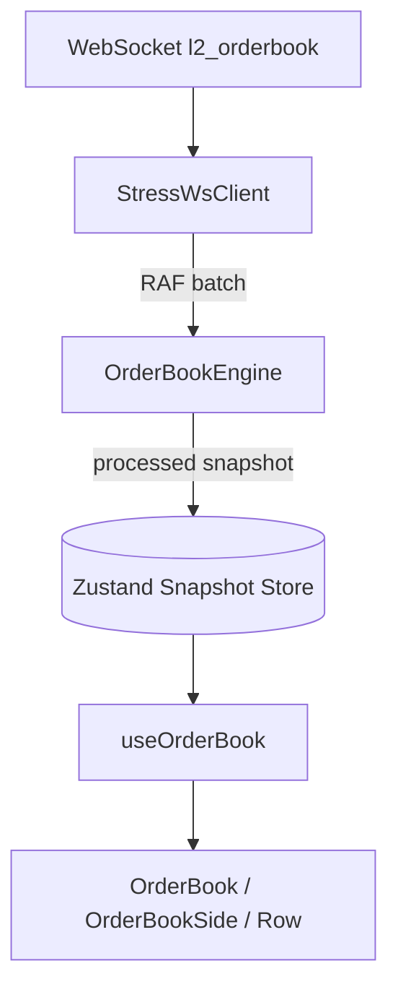

# Order Book Rearchitecture Plan

Migrate the current WebSocket → Zustand → React processing pipeline into a production-grade, high-frequency order book architecture suitable for crypto exchanges, trading dashboards, and 100+ updates/sec streams with virtualized UIs.

---

## Table of Contents

1. [Goal](#goal)
2. [Current Architecture](#current-architecture)
3. [Current Problems](#current-problems)
4. [Target Architecture](#target-architecture)
5. [Target Directory Layout](#target-directory-layout)
6. [Layer Responsibilities](#layer-responsibilities)
7. [Migration Phases](#migration-phases)
8. [Expected Performance Impact](#expected-performance-impact)
9. [Final Runtime Flow](#final-runtime-flow)
10. [Acceptance Criteria](#acceptance-criteria)

---

## Goal

| Requirement | Target |
|-------------|--------|
| Update rate | 100+ msgs/sec sustained |
| Main-thread work | Rendering + virtualization only |
| GC pressure | Minimal per-frame allocations |
| React rerenders | One per RAF frame per symbol |
| Row stability | Stable references for unchanged levels |
| Scalability | Worker-ready engine boundary |

---

## Current Architecture

### Current Flow

```txt
WebSocket (l2_orderbook)
   ↓
StressWsClient.route() — RAF batching per message type (good)
   ↓
OrderBook.tsx handler → setBook(RawBook)
   ↓
orderbook.actions.ts — normalisePrice / mergeSide (Record-based)
   ↓
Zustand update (bySymbol[symbol] = NormalisedBook)
   ↓
React rerender (OrderBook subscribes to raw normalised book)
   ↓
processBook(rawBook, groupIncrement)  ← IN RENDER
   ↓
grouping → sorting → running totals → spread metrics
   ↓
OrderBookSide → TanStack Virtual → OrderBookRow
```

### Current File Map

| Layer | Path | Role today |
|-------|------|------------|
| WS client | `src/lib/stress-ws/client.ts` | Connect, batch, demux |
| WS handler | `src/features/orderbook/components/OrderBook.tsx` | Subscribe + `setBook()` |
| Actions | `src/lib/stores/orderbook/orderbook.actions.ts` | `setBook`, `clearBook`, `normalisePrice` |
| Store | `src/lib/stores/orderbook/orderbook.store.ts` | `NormalisedBook` per symbol |
| Processing | `src/lib/orderbook/group.ts` | `processBook()` — grouping, sort, totals |
| UI | `src/features/orderbook/components/*` | Virtualized sides + rows |

### Current Data Shapes

```ts
// Wire (WebSocket)
RawLevel = [price: string, size: string]
RawBook = { symbol, bids: RawLevel[], asks: RawLevel[] }

// Store (Zustand) — today
NormalisedBook = {
  symbol,
  bids: Record<number, number>,
  asks: Record<number, number>,
}

// Render (recomputed every render) — today
ProcessedLevel = { price, size, total }
ProcessedBook = { bids, asks, mid, spread, spreadBps, imbalance }
```

---

## Current Problems

### 1. Heavy Processing in Render

```ts
// OrderBook.tsx — runs on every store update + every parent rerender
const book = processBook(rawBook, groupIncrement);
const maxAskTotal = book.asks.length ? Math.max(...book.asks.map((l) => l.total)) : 0;
const maxBidTotal = book.bids.length ? Math.max(...book.bids.map((l) => l.total)) : 0;
```

**Impact:** regrouping, resorting, new arrays, new row objects every frame.

---

### 2. Zustand Used as Tick Transport

`setBook()` is called from the WebSocket handler on every batched message. Zustand holds **intermediate normalised state**, not a render-ready snapshot.

**Impact:** invalidates selectors, memoization, and virtualization key stability.

---

### 3. Massive Object Allocation

Every frame allocates:

- new `Record` spreads in `setState`
- `Object.entries` in `mergeSide` / `group()`
- new `Map` instances in `processBook`
- new `ProcessedLevel` objects per row

**Impact:** GC pressure under stress-test load.

---

### 4. Unstable References

Each `processBook()` cycle creates fresh objects:

```ts
{ price, size, total }  // new reference every time
```

**Impact:** `React.memo(OrderBookRow)` provides little benefit.

---

### 5. Full Book Reprocessing

Even when a single price level changes, the pipeline rebuilds grouping, sorting, and running totals for the entire book.

---

### 6. Subscription Logic in UI

`OrderBook.tsx` owns WebSocket subscribe/unsubscribe. This couples transport to presentation and blocks multi-symbol engine reuse.

---

## Target Architecture

### Desired Flow

```txt
WebSocket
   ↓
StressWsClient RAF batching (unchanged)
   ↓
OrderBookEngine.process(messages)
   ↓
Mutable normalized Maps
   ↓
Incremental aggregation (dirty buckets)
   ↓
Stable processed snapshot
   ↓
Single Zustand snapshot update (once per RAF frame)
   ↓
React render only (no processing)
```

### Architecture Diagram



---

## Target Directory Layout

```txt
src/features/orderbook/
  engine/
    OrderBookEngine.ts      # Orchestrator: process(), snapshot emit
    types.ts                # Level, ProcessedLevel, ProcessedBook, DirtyFlags
    normalization.ts        # RawLevel[] → Map updates, zero-size deletes
    aggregation.ts          # Bucket grouping, dirty-bucket recompute
    sorting.ts              # Incremental / dirty-region sort
    metrics.ts              # mid, spread, spreadBps, imbalance, max totals
  store/
    orderbook.store.ts      # ProcessedBook snapshots only
    orderbook.actions.ts    # setSnapshot, clearSnapshot
  hooks/
    useOrderBook.ts         # symbol + groupIncrement → snapshot selector
  components/               # unchanged surface, simplified props
    OrderBook.tsx
    OrderBookSide.tsx
    OrderBookRow.tsx
    SpreadMetrics.tsx
    GroupingSelector.tsx
```

**Deprecate / remove after migration:**

- `src/lib/orderbook/group.ts` → logic moves into `engine/`
- `NormalisedBook` in Zustand → engine-internal only
- `setBook(RawBook)` from React handlers → engine entry point

---

## Layer Responsibilities

### WebSocket Layer (`StressWsClient`)

**ONLY:**

- connect / reconnect
- subscribe / unsubscribe
- route messages
- RAF batch per channel type

**MUST NOT:**

- normalize prices
- merge books
- compute spread or depth

---

### OrderBook Engine

**OWNS:**

- normalization (wire → `Map<number, Level>`)
- delta application (size `0` → delete)
- aggregation (group increment buckets)
- running totals and max depth
- sorting (incremental where possible)
- stable object references for unchanged rows
- processed snapshot construction

**INTERNAL STATE (mutable):**

```ts
class OrderBookEngine {
  private bids = new Map<number, Level>();
  private asks = new Map<number, Level>();

  private aggregatedBids: ProcessedLevel[] = [];
  private aggregatedAsks: ProcessedLevel[] = [];

  private maxBidTotal = 0;
  private maxAskTotal = 0;

  private dirtyBidBuckets = new Set<number>();
  private dirtyAskBuckets = new Set<number>();

  process(messages: RawBook[]): void { /* ... */ }
  getSnapshot(symbol: TradingSymbol): ProcessedBook { /* ... */ }
}
```

**Important rule:** engine internals are **mutable**. Do not use immutable spread patterns inside the hot path.

---

### Zustand

**ONLY stores** the latest **processed snapshot** per symbol:

```ts
type OrderBookSnapshotStore = {
  snapshots: Partial<Record<TradingSymbol, ProcessedBook | null>>;
};
```

**Update rule:** at most **one `setState` per symbol per RAF frame**, after engine processing completes.

---

### React

**ONLY:**

- subscribe via `useOrderBook(symbol)`
- render virtualized lists
- handle focus / grouping UI events (notify engine of increment change)

**MUST NOT:**

- call `processBook()`
- call `setBook()` from WS handlers
- allocate row objects in render

---

## Migration Phases

### Phase 1 — Create OrderBook Engine Scaffold

**Tasks:**

- [ ] Add `features/orderbook/engine/` module structure
- [ ] Define `types.ts` (`Level`, `ProcessedLevel`, `ProcessedBook`, `RawBook` wire types)
- [ ] Implement `OrderBookEngine` class with empty `process()` and `getSnapshot()`
- [ ] Port existing `processBook` logic into engine as baseline (correctness first, optimize later)
- [ ] Unit tests against known grouping outputs from `group.ts`

**Exit criteria:** engine produces identical output to current `processBook` for fixture data.

---

### Phase 2 — Replace `Record` With `Map`

**Before:**

```ts
asks: Record<number, number>
```

**After:**

```ts
asks: Map<number, Level>   // Level = { size: number }
```

**Why:**

| Benefit | Detail |
|---------|--------|
| O(1) updates | `map.set` / `map.delete` |
| Lower GC | no `Object.entries` per merge |
| Stable keys | numeric iteration without string coercion |
| Cleaner deletes | `size === 0` → `map.delete(price)` |

**Tasks:**

- [ ] Migrate `normalisePrice` / `mergeSide` to Map-based delta apply
- [ ] Remove `levelsToRecord` and `Object.entries` hot paths
- [ ] Update engine tests

---

### Phase 3 — Mutable Engine State

**Tasks:**

- [ ] Hold bids/asks as private `Map` instances on engine instance (per symbol or registry)
- [ ] Apply deltas in place: `existing.size = size` or `map.delete(price)`
- [ ] Stop spreading `bySymbol` objects on every tick in Zustand

**Exit criteria:** no new `Record`/`Map` allocation per websocket message for unchanged sides.

---

### Phase 4 — Move Delta Processing Out of React

**Remove from `OrderBook.tsx`:**

```ts
setBook(orderbook);
```

**Replace with engine wiring (provider or hook):**

```ts
client.on('l2_orderbook', (messages) => {
  orderBookEngine.process(messages);
  commitSnapshotsToStore(); // once per frame
});
```

**Tasks:**

- [ ] Register engine handler at app/provider level (alongside or inside `StressWsProvider`)
- [ ] Keep subscribe/unsubscribe lifecycle colocated with focus symbol
- [ ] `clearBook` → engine reset + snapshot `null`

---

### Phase 5 — Remove `processBook()` From React

**Delete:**

```ts
const book = processBook(rawBook, groupIncrement);
```

**Replace:**

```ts
const snapshot = useOrderBook(focusedSymbol);
// snapshot = { bids, asks, maxBidTotal, maxAskTotal, mid, spread, ... }
```

**Tasks:**

- [ ] Implement `useOrderBook(symbol)` with narrow Zustand selector
- [ ] Pass precomputed `maxBidTotal` / `maxAskTotal` to `OrderBookSide`
- [ ] Grouping increment change triggers engine re-aggregation, not React recompute

---

### Phase 6 — Stable Snapshot References

**Bad (today):**

```ts
return { price, size, total }; // new object every frame
```

**Good:**

```ts
existing.size = nextSize;
existing.total = nextTotal;
// same object reference if row unchanged from UI perspective
```

**Tasks:**

- [ ] Pool or reuse `ProcessedLevel` instances in engine arrays
- [ ] Only replace array slots when bucket membership changes
- [ ] Document reference stability contract for `React.memo`

**Exit criteria:** React Profiler shows memoized rows skip render when level unchanged.

---

### Phase 7 — Incremental Aggregation

**Problem:** full regroup of 500+ levels every frame.

**Fix:** track dirty price levels → dirty buckets → recompute only affected buckets.

```txt
price 50001 changed
   ↓
mark bucket 50000 dirty (for increment 100)
   ↓
recompute only bucket 50000, merge into aggregated array
```

**Tasks:**

- [ ] `dirtyBidBuckets` / `dirtyAskBuckets` sets on engine
- [ ] Full regroup only on: symbol change, group increment change, first snapshot
- [ ] Benchmark: compare frame time vs full `processBook`

---

### Phase 8 — Incremental Sorting

**Problem:** `.sort()` on full aggregated arrays every frame.

**Options (pick based on benchmark):**

| Strategy | When to use |
|----------|-------------|
| Dirty-region sort | few changed buckets per frame |
| Binary insertion | single-level updates |
| Full sort | group increment change / resync |

**Tasks:**

- [ ] Implement dirty-region sort for bids (desc) and asks (asc)
- [ ] Fall back to full sort on resync
- [ ] Cap visible depth (`MAX_LEVELS`) after sort

---

### Phase 9 — Zustand Snapshot Store

**Replace store shape:**

```ts
// Before
bySymbol: Partial<Record<TradingSymbol, NormalisedBook | null>>

// After
snapshots: Partial<Record<TradingSymbol, ProcessedBook | null>>
```

**Tasks:**

- [ ] `setSnapshot(symbol, book)` — called once per engine flush
- [ ] Shallow-compare snapshot before setState to skip no-op renders
- [ ] Remove raw/normalised book from public store API

---

### Phase 10 — Optimize React Rendering

**Tasks:**

- [ ] Ensure `OrderBookRow` is `memo` with stable `level` reference
- [ ] `getItemKey: (i) => levels[i].price` (already in `OrderBookSide`)
- [ ] No inline object/function props on rows
- [ ] Move `maxTotal` to snapshot (avoid `.map` in render)
- [ ] `useOrderBook` selector returns primitives + stable array refs

**Anti-patterns to avoid:**

```tsx
// BAD
<Row row={{ ...row }} />
<Row onHover={() => ...} />  // new function each render

// GOOD
<Row level={row} />
```

---

### Phase 11 — Virtualization Hardening

**Tasks:**

- [ ] Fixed `estimateSize: 24` (matches `h-6`)
- [ ] Stable `getItemKey` from price
- [ ] `min-h-0` flex chain (already applied in `OrderBookSide` / `App`)
- [ ] Optional: `measureElement` only if row height becomes dynamic
- [ ] Scroll position preservation on incremental updates (if needed for UX)

---

### Phase 12 — Web Worker Migration (Future)

**Move off main thread:**

- normalization
- aggregation
- sorting
- totals / imbalance

**Main thread retains:**

- rendering
- virtualization
- user interactions (grouping selector, focus)

**Tasks:**

- [ ] Define `orderbook.worker.ts` message protocol (`process` / `snapshot`)
- [ ] Transferable or structured-clone snapshot to store
- [ ] Feature flag: `VITE_ORDERBOOK_WORKER=true`

---

## Expected Performance Impact

| Optimization | Expected impact |
|--------------|-----------------|
| Remove processing from render | **Massive** |
| Mutable engine + Map | **Massive** |
| Stable row references | **Massive** |
| Snapshot-only Zustand | **High** |
| Incremental aggregation | **High** |
| Incremental sorting | **High** |
| Memoized rows + stable keys | **Medium** |
| Worker migration | **Huge** at 500+ levels × many symbols |

---

## Final Runtime Flow

```txt
Socket Tick
    ↓
StressWsClient.route() — buffer + RAF flush
    ↓
OrderBookEngine.process(messages[])
    ↓
mutable Map updates (normalize + delta)
    ↓
dirty bucket aggregation
    ↓
incremental sort + running totals
    ↓
stable ProcessedBook snapshot
    ↓
Zustand setSnapshot (once per frame)
    ↓
useOrderBook(selector) → React
    ↓
TanStack Virtual → memo(OrderBookRow)
```

---

## Acceptance Criteria

### Functional

- [ ] Grouping increments match current `group.ts` behavior per symbol
- [ ] Spread, mid, spreadBps, imbalance match within float tolerance
- [ ] Focus switch clears book and resubscribes without stale flash
- [ ] Zero-size levels removed from book

### Performance

- [ ] No `processBook` (or equivalent) in React render path
- [ ] ≤ 1 Zustand commit per symbol per animation frame under stress load
- [ ] React Profiler: unchanged rows do not rerender
- [ ] Stable 60fps with stress server at documented message rates

### Architecture

- [ ] WebSocket client has zero order-book business logic
- [ ] Engine is unit-testable without React
- [ ] Store exposes processed snapshots only
- [ ] Clear boundary for future worker extraction

---

## Migration Order Summary

| Phase | Focus | Risk |
|-------|-------|------|
| 1 | Engine scaffold + parity tests | Low |
| 2 | Map migration | Low |
| 3 | Mutable state | Medium |
| 4 | WS handler relocation | Medium |
| 5 | Remove render processing | Medium |
| 6 | Stable references | Medium |
| 7–8 | Incremental agg/sort | High |
| 9 | Snapshot store | Low |
| 10–11 | React + virtualizer | Low |
| 12 | Worker | High (optional) |

**Recommended approach:** phases 1–5 first (correctness + remove render hot path), then 6–9 (performance), then 10–11 (polish), then 12 when profiling demands it.

---

## Related Documents

- [`REALTIME_DASHBOARD_PLAN.md`](./REALTIME_DASHBOARD_PLAN.md) — original dashboard requirements and store design
- [`README.md`](./README.md) — setup and stress-server usage

---

*Last updated: aligned with codebase state — `NormalisedBook` in Zustand, `processBook` in render, RAF batching in `StressWsClient`.*
