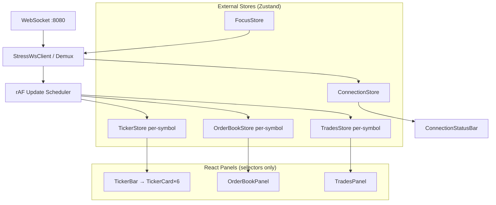

# Real-Time Trading Dashboard — Implementation Plan

> **Assignment:** High-frequency crypto derivatives market data dashboard  
> **Stack:** Next.js 16 · React 19 · TypeScript · Zustand · Tailwind CSS 4  
> **Backend:** [socket-custom-load](https://github.com/saxenanickk/socket-custom-load) (`ws://localhost:8080`, config API `:3000`)  
> **Scope:** Ticker bar + Order book + Trades feed — depth over breadth  
> **Status:** Planning (builds on existing `trading-clone` scaffold)

---

## 1. Goals & Evaluation Alignment

This plan is structured around the four grading criteria. Every architectural decision below maps to at least one criterion.

| Criterion | Weight | How this plan addresses it |
|-----------|--------|----------------------------|
| **Architecture & State Isolation** | 30% | Domain-separated stores, selector-based subscriptions, single WS demux layer, no cross-panel re-render |
| **Performance Under Stress** | 30% | rAF batching, optional worker for grouping, virtualization, profiling harness, bounded buffers |
| **Order Book Depth** | 20% | Precision-aware grouping pipeline, unit-tested aggregation, incremental metric recompute |
| **Problem Decomposition** | 20% | Phased commits, `docs/ARCHITECTURE.md` with tradeoff analysis, measurable perf notes |

### 1.1 Success criteria (measurable)

| Metric | Target |
|--------|--------|
| Ticker update → paint (single card) | < 16 ms p95 (one frame) |
| Order book update → paint | < 16 ms p95 at default load; < 33 ms p95 under stress |
| Trades feed | No main-thread freeze at 200+ trades/s ingress |
| Cross-panel re-renders | BTC ticker update → 0 order book / trades re-renders (React Profiler) |
| Reconnect recovery | Full resubscribe + UI recovery < 3 s without page refresh |
| Memory | Stable over 10 min stress run (no unbounded growth) |

---

## 2. Wireframe → UI Layout

Reference layout (dark terminal aesthetic, matching existing `globals.css` tokens):


*Section 1: ticker strip (`v2/ticker`, ~12–30 msgs/sec). Section 2: order book (`l2_orderbook`, 50–100 ms). Section 3: recent trades (`all_trades`, 10–40 ms).*

```
┌──────────────────────────────────────────────────────────────────────────────┐
│ ● Connected   8 channels   ws://localhost:8080                             │
├──────────────────────────────────────────────────────────────────────────────┤
│ [BTCUSD] [ETHUSD] [XRPUSD] [SOLUSD] [PAXGUSD] [DOGEUSD]  ← horizontal bar   │
│   Perp     Perp      Perp      Perp       Perp        Perp                    │
│  price    price     price     price      price       price                    │
│  +0.12%   -0.45%    +1.02%   ...        ...          ...                     │
│  sparkline (optional v2)                                                     │
├───────────────────────────────┬──────────────────────────────────────────────┤
│ Order Book — ETHUSD    LIVE   │ Recent Trades — ETHUSD                       │
│ Group: [1][5][10][50]...      │ Large trade ≥ [$10,000]                      │
│                               │ ┌ 1m Vol │ 1m Trades │ Avg Size ──────────┐│
│ Asks (red)                    │ │ buy/sell split bar                      ││
│ Total │ Size │ Price          │ └─────────────────────────────────────────┘│
│ ─────────────────────────     │ Time      │ Price    │ Size                 │
│ Mid │ Spread │ Imbalance      │ 12:01:02  │ 62343.75 │ 0.893 (3)            │
│ ─────────────────────────     │ ... large trade row highlighted ...        │
│ Bids (green)                  │                              [Jump to latest]│
│ Price │ Size │ Total          │                                              │
└───────────────────────────────┴──────────────────────────────────────────────┘
```

### 2.1 Route & page structure

| Route | Purpose |
|-------|---------|
| `/` or `/dashboard` | Main dashboard (single page, no chart/order-entry scope) |

Focused symbol stored in URL query (`?symbol=ETHUSD`) **and** `localStorage` for reload persistence.

### 2.2 Component tree

```
app/dashboard/page.tsx                    # RSC shell + client mount
components/dashboard/
  DashboardShell.tsx                      # Grid layout (header + 3 sections)
  ConnectionStatusBar.tsx                 # Status dot, channel count, WS URL
  ticker/
    TickerBar.tsx                         # Horizontal scroll container
    TickerCard.tsx                        # memo'd per symbol — ISOLATION KEY
  orderbook/
    OrderBookPanel.tsx                    # Header, grouping, metrics, rows
    OrderBookRow.tsx                      # memo'd row + flash animation
    GroupingSelector.tsx                  # Symbol-adaptive increments
    SpreadMetrics.tsx                     # Mid, spread, imbalance
  trades/
    TradesPanel.tsx                       # Header, threshold input, list
    TradesStatsBar.tsx                    # Rolling 60s stats (1 Hz UI tick)
    TradeRow.tsx                          # memo'd row
    JumpToLatest.tsx                      # Sticky footer CTA
components/providers/
  StressWsProvider.tsx                    # Single WS lifecycle + demux
lib/
  stress-ws/                              # Backend-specific protocol
  stores/                                 # Domain-isolated Zustand stores
  orderbook/                              # Grouping + metrics (pure TS)
  trades/                                 # Aggregation + rolling window
  perf/                                   # Profiler helpers)
```

### 2.3 Visual tokens (reuse existing palette)

| Element | Token / value |
|---------|---------------|
| Background | `#0b0e11` |
| Panel/card | `#14151a` |
| Border | `#1e2329` |
| Buy / bid | `#0ecb81` |
| Sell / ask | `#f6465d` |
| Focused ticker | Blue bottom border + subtle bg |
| LIVE badge | Yellow accent |
| Large trade | Bold + tinted background + left border |

---

## 3. Backend Integration

### 3.1 Connection & protocol

- **URL:** `ws://localhost:8080` (env: `NEXT_PUBLIC_STRESS_WS_URL`)
- **Single WebSocket** multiplexing all subscriptions
- **Subscribe format** (stress backend):

```json
{
  "type": "subscribe",
  "payload": {
    "channels": [
      { "name": "v2/ticker", "symbols": ["BTCUSD","ETHUSD","XRPUSD","SOLUSD","PAXGUSD","DOGEUSD"] },
      { "name": "l2_orderbook", "symbols": ["ETHUSD"] },
      { "name": "all_trades", "symbols": ["ETHUSD"] }
    ]
  }
}
```

- **Ack:** `{ type: "subscriptions", payload: { channels: [...] } }` — sync local subscription state
- **Data messages:** Channel-specific payloads (see §3.2)

### 3.2 Message schemas (Zod-validated)

Define strict parsers in `lib/stress-ws/schemas.ts`:

| Channel | Key fields | Notes |
|---------|------------|-------|
| `v2/ticker` | `symbol`, `close`/`mark_price`, `ltp_change_24h`, `type` | Use `close` as last price; derive 24h % from `ltp_change_24h` |
| `l2_orderbook` | `symbol`, `bids[]`, `asks[]` with `price`, `size` | 500 levels each side; full snapshot each message |
| `all_trades` | `symbol`, `price`, `size`, `timestamp` (µs), `buyer_role` | Side: infer buy/sell from `buyer_role` or price vs mid |

Reject malformed messages silently; never crash the demux loop.

### 3.3 Subscription lifecycle

```
App mount
  → connect WS
  → subscribe 6× v2/ticker (always)
  → subscribe l2_orderbook + all_trades for focused symbol

User clicks ticker (symbol change)
  → set loading state on book + trades panels
  → clear book/trades store for old symbol
  → unsubscribe old symbol from l2_orderbook + all_trades
  → subscribe new symbol
  → persist focus to localStorage + URL
  → clear loading when first message for new symbol arrives

Reconnect (exponential backoff: 1s → 2s → 4s → … cap 30s)
  → status: reconnecting
  → on open: replay full subscription set from registry
  → await subscriptions ack
  → status: connected
```

### 3.4 Runtime config API (eval / profiling)

Document in README for evaluators:

```bash
# Stress mode
curl -X POST http://localhost:3000/intervals \
  -H "Content-Type: application/json" \
  -d '{"all_trades":{"min":1,"max":5},"l2_orderbook":{"min":10,"max":20}}'
```

App does **not** need to call this API — but our perf docs will reference it.

---

## 4. Architecture & State Isolation (30%)

> **Core rule:** One message type → one store slice → one panel. No shared React context for tick data.

### 4.1 Layered architecture



### 4.2 Store design (separate files)

| Store | State | Update trigger | Subscribers |
|-------|-------|----------------|-------------|
| `useTickerStore` | `Record<Symbol, TickerSnapshot>` | `v2/ticker` msgs | `TickerCard` only (via `useTickerStore(s => s.bySymbol[sym])`) |
| `useOrderBookStore` | `Record<Symbol, RawBook \| null>` | `l2_orderbook` msgs | `OrderBookPanel` for focused symbol only |
| `useTradesStore` | `Record<Symbol, TradesFeedState>` | batched `all_trades` | `TradesPanel` for focused symbol only |
| `useFocusStore` | `focusedSymbol`, `groupIncrement` | user actions | WS provider + panels |
| `useConnectionStore` | `status`, `channelCount`, `wsUrl` | WS events | `ConnectionStatusBar` |

**Anti-pattern to avoid:** Single `useMarketStore` with `{ tickers, orderBook, trades }` — any `set()` fans out to all selectors unless carefully split.

**Preferred pattern:**

```ts
// TickerCard.tsx — re-renders ONLY when its symbol changes
const ticker = useTickerStore((s) => s.bySymbol[symbol]);
```

Use `zustand/shallow` only where selecting small objects; prefer primitive selectors.

### 4.3 Update batching (demux → store)

High-frequency path:

1. WS `onmessage` parses JSON → route by `type` + `symbol`
2. Push into **per-domain ring buffers** (not React state)
3. `requestAnimationFrame` flush (max 1 store commit per domain per frame):
   - Tickers: merge latest per symbol in buffer (drop intermediate)
   - Order book: keep **latest snapshot only** per frame (backend sends full book)
   - Trades: append to ingress buffer; aggregation runs on flush

This intentionally drops intermediate frames under stress — UI stays responsive; evaluators expect this tradeoff (document it).

### 4.4 Focus switch — prevent stale flash

Sequence (atomic from UI perspective):

1. `useOrderBookStore.getState().clear(focusedSymbol)` — immediate empty/loading
2. `useTradesStore.getState().clear(focusedSymbol)`
3. Send unsubscribe/subscribe via WS
4. Panels read `null` → show skeleton/spinner until first payload

### 4.5 TypeScript rigor

- No `any`; use `unknown` + Zod at boundaries
- Branded types: `type Symbol = 'BTCUSD' | 'ETHUSD' | ...`
- Pure functions for all derived state (grouping, spread, stats) — fully unit-testable

---

## 5. Section 1 — Multi-Product Ticker Bar

### 5.1 Requirements checklist

- [ ] Subscribe `v2/ticker` for all 6 symbols on mount
- [ ] Display: symbol, last price, 24h change % (green/red)
- [ ] Click → set focused product
- [ ] Visual highlight on focused ticker
- [ ] Persist selection across reload (`localStorage` key: `dashboard:focusedSymbol`)

### 5.2 Isolation strategy

- `TickerBar` renders 6 `TickerCard` components
- Each card: `React.memo` + `useTickerStore(s => s.bySymbol[symbol])`
- **Profiler test:** Update BTC → only `TickerCard(BTCUSD)` commits

### 5.3 Formatting

Symbol-specific decimal places from config table:

| Symbol | Precision | Example format |
|--------|-----------|----------------|
| BTCUSD | 1 dp | `62,343.7` |
| ETHUSD | 2 dp | `1,823.45` |
| XRPUSD | 4 dp | `1.2345` |
| SOLUSD | 4 dp | `75.123456` |
| PAXGUSD | 2 dp | `5,234.56` |
| DOGEUSD | 6 dp | `0.082345` |

Centralize in `lib/symbols/config.ts` — drives grouping options too.

---

## 6. Section 2 — Live Order Book (hardest section)

### 6.1 Requirements checklist

- [ ] Asks top (lowest ask closest to mid), bids bottom (highest bid closest to mid)
- [ ] Columns: price, size, cumulative size, depth bar
- [ ] Spread metrics: mid, spread (abs + bps), imbalance (bid vol / ask vol)
- [ ] Grouping selector — symbol-adaptive increments
- [ ] Grouped aggregation correct for all symbols
- [ ] Flash row on size change ≥ 10% (green up / red down)
- [ ] No flicker, layout shift, or scroll jump

### 6.2 Grouping increments (symbol-adaptive)

Derive from tick precision (not hardcoded per env):

| Symbol | Group options |
|--------|---------------|
| BTCUSD (1 dp) | 1, 5, 10, 50, 100, 500 |
| ETHUSD (2 dp) | 0.50, 1, 5, 10, 50 |
| XRPUSD (4 dp) | 0.0001, 0.001, 0.01, 0.1 |
| SOLUSD (4 dp) | 0.01, 0.1, 0.5, 1, 5 |
| PAXGUSD (2 dp) | 0.50, 1, 5, 10, 50 |
| DOGEUSD (6 dp) | 0.000001, 0.00001, 0.0001, 0.001, 0.01 |

Store selected increment per symbol in `localStorage` (`dashboard:group:{symbol}`).

### 6.3 Grouping algorithm (`lib/orderbook/group.ts`)

Pure pipeline — **no React dependencies**:

```
RawBook { bids: Level[], asks: Level[] }
  → normalize prices to number
  → bucket: bucketPrice = floor(price / increment) * increment
  → aggregate sizes per bucket (sum)
  → sort asks ascending, bids descending
  → compute cumulative sizes (running sum from touch outward)
  → compute maxCumulative for depth bar scale
  → derive metrics: bestBid, bestAsk, mid, spread, spreadBps, imbalance
  → return GroupedBookView
```

**Performance notes:**

- 500 levels × 2 sides = 1000 rows — grouping is O(n) per update
- At 10–20 ms ingress, grouping must stay < 4 ms — benchmark in Vitest + Chrome Performance
- **Optional Phase 3:** Move `groupBook()` to Web Worker; postMessage grouped result only

### 6.4 Depth bars

- Width = `(level.cumulative / maxCumulative) * 100%`
- `maxCumulative` = max of visible side cumulatives (asks and bids independently or global — pick one, document choice; wireframe suggests per-side)
- Use CSS `transform: scaleX()` from left/right instead of animating `width` — avoids layout thrash
- Row height fixed (`h-6` or `24px`) — prevents layout shift

### 6.5 Flash highlights

Track previous grouped sizes in a `Map<bucketPrice, size>` ref (not in Zustand state):

```
on flush:
  for each level:
    prev = prevSizes.get(price)
    if prev && abs(size - prev) / prev >= 0.10:
      flash = size > prev ? 'up' : 'down'
    prevSizes.set(price, size)
```

Apply CSS animation class for ~300 ms; use `data-flash="up|down"` attribute. Do **not** store flash in Zustand (would cause extra renders).

### 6.6 Display rows

- Show top N levels per side (e.g. 25) — virtualize if N > 30 (`@tanstack/react-virtual`)
- Under stress, cap visible rows before virtualizing — simpler first, virtualize in Phase 3 if needed

### 6.7 Spread & imbalance (grouped view)

Computed from **grouped** touch prices:

```
bestAsk = asks[0].price
bestBid = bids[0].price
mid = (bestAsk + bestBid) / 2
spread = bestAsk - bestBid
spreadBps = (spread / mid) * 10000
imbalance = sum(bidSizesVisible) / sum(askSizesVisible)  // or bid/(bid+ask)
```

Recalculate on every grouped book recompute — cheap relative to grouping.

---

## 7. Section 3 — Live Trades Feed

### 7.1 Requirements checklist

- [ ] Columns: time (HH:MM:SS.ms), price, size, side (color)
- [ ] Aggregate same-price trades within 100 ms window → `size (count)`
- [ ] Large trade highlight (user-configurable notional threshold)
- [ ] Auto-scroll; pause when user scrolls up; "Jump to latest"
- [ ] Rolling stats bar (60 s window, UI refresh 1 Hz): buy vol, sell vol, trade count, avg size

### 7.2 Ingress & batching

- Raw trades appended to per-symbol buffer on WS message
- On rAF flush: run aggregation pipeline on buffer, clear buffer
- Cap displayed rows at 500 (ring buffer) — evict oldest

### 7.3 Trade aggregation (`lib/trades/aggregate.ts`)

```
Input: Trade[] sorted by timestamp
Window: 100 ms, same price, same side

Walk sorted trades:
  if matches current bucket (price, side, within 100ms of bucket start):
    accumulate size, count++
  else:
    emit bucket, start new

Output: AggregatedTrade { price, totalSize, count, side, timestamp }
```

### 7.4 Side detection

Prefer explicit field if backend provides; fallback:

- `buyer_role === 'taker'` → buy (aggressive buy)
- else sell

Validate against sample payloads during Phase 1.

### 7.5 Large trade threshold

- Default: $10,000 notional (`price * size >= threshold`)
- Persist in `localStorage` (`dashboard:largeTradeThreshold`)
- Distinct row style: bold, background tint, left accent border

### 7.6 Auto-scroll behavior

- Container: `ScrollArea` or overflow div with ref
- `isPinnedToBottom` ref updated on scroll events
- New rows appended → scroll to bottom only if pinned
- If not pinned → show sticky "Jump to latest" footer
- Click → set pinned, scroll to bottom

### 7.7 Rolling 60s stats (`lib/trades/rolling-stats.ts`)

Data structure: **time-indexed deque** of `{ ts, size, side, notional }`

```
on each aggregated trade:
  push to deque
  prune while front.ts < now - 60_000

every 1s (setInterval, NOT per trade):
  compute buyVol, sellVol, count, avgSize
  update TradesStatsBar via store or local state
```

Prune on insert keeps amortized O(1) per trade; stats recompute O(n) once per second on ≤ few thousand entries — acceptable.

---

## 8. Performance Under Stress (30%)

### 8.1 Strategies summary

| Technique | Applies to | Tradeoff |
|-----------|------------|----------|
| rAF batching + latest-wins (book/ticker) | Book, tickers | Drops intermediate frames; document as intentional |
| Per-symbol store selectors | Tickers | Zero cross-symbol re-renders |
| `React.memo` on rows | Book, trades | Stable props; preformatted strings |
| Virtualization | Book (if needed), trades | Slight scroll complexity |
| Web Worker grouping | Order book | +complexity, −main-thread jank |
| Ring buffers + caps | Trades | Bounded memory |
| Pre-format numbers in flush | All panels | Avoid `Intl` in render |
| `contain: strict` on panels | Layout | Isolates paint |

### 8.2 Profiling plan (evidence for evaluators)

Create `docs/PERFORMANCE.md` with recorded results:

1. **React DevTools Profiler**
   - Record 10 s default load: verify ticker isolation
   - Record 10 s stress load (`all_trades` 1–5 ms)

2. **Chrome Performance**
   - Main thread flame chart during stress
   - Target: no long tasks > 50 ms sustained

3. **Memory**
   - Heap snapshot at T=0 and T=10 min stress
   - Trades list capped; confirm flat heap

4. **Custom counters** (dev-only, env` flag):

```ts
// lib/perf/metrics.ts
messagesReceived, messagesFlushed, framesDropped, avgGroupingMs
```

Expose in dev overlay or console — optional `?debug=perf` query param.

### 8.3 Stress test procedure (document in README)

```bash
# Terminal 1
cd socket-custom-load && bun start

# Terminal 2
npm run dev

# Terminal 3 — ramp stress
curl -X POST http://localhost:3000/intervals \
  -d '{"all_trades":{"min":1,"max":5},"l2_orderbook":{"min":10,"max":20},"v2/ticker":{"min":10,"max":30}}'
```

Verify: UI responsive, no freeze, recovery when intervals restored to defaults.

---

## 9. WebSocket Manager Refactor

Existing `lib/ws/websocket-connection-manager.ts` targets Binance/topic protocol. **Add parallel implementation** for stress backend (don't break existing if still needed):

`lib/stress-ws/stress-ws-client.ts`:

| Responsibility | Detail |
|----------------|--------|
| Connect / disconnect | Singleton, same pattern as existing manager |
| Backoff | Exponential: `min(1000 * 2^attempt, 30000)` + jitter |
| Subscription registry | `Map<channel, Set<symbol>>` — source of truth for reconnect |
| Send batch subscribe | Merge registry into one message on connect |
| Demux | Route by `message.type` to handlers |
| Status | Emit to `useConnectionStore` |

Provider: `StressWsProvider` mounts once at dashboard layout; panels are dumb consumers.

---

## 10. Persistence

| Key | Storage | Value |
|-----|---------|-------|
| `dashboard:focusedSymbol` | localStorage | `ETHUSD` |
| `dashboard:group:{symbol}` | localStorage | numeric increment |
| `dashboard:largeTradeThreshold` | localStorage | number (USD) |

Hydrate on client mount; SSR defaults to `BTCUSD`.

---

## 11. Implementation Phases & Git Strategy

Logical commit progression for **Problem Decomposition (20%)**:

### Phase 0 — Scaffold & docs (Commit 1–2)

- [ ] Add `docs/REALTIME_DASHBOARD_PLAN.md` (this file)
- [ ] Add `docs/ARCHITECTURE.md` skeleton
- [ ] Symbol config + Zod schemas for WS payloads
- [ ] `/dashboard` route with static shell matching wireframe

**Commit 1:** `docs: add realtime dashboard plan and architecture skeleton`  
**Commit 2:** `feat(dashboard): scaffold layout and symbol config`

### Phase 1 — WebSocket foundation (Commit 3–4)

- [ ] `StressWsClient` with connect, backoff, subscription registry
- [ ] `ConnectionStatusBar` (connected / reconnecting / disconnected)
- [ ] Subscribe/unsubscribe integration tested against local backend

**Commit 3:** `feat(ws): stress-test WebSocket client with reconnect`  
**Commit 4:** `feat(ws): subscription registry and ack handling`

### Phase 2 — Ticker bar (Commit 5–6)

- [ ] `useTickerStore` with per-symbol selectors
- [ ] `TickerBar` + `TickerCard` with rAF batching
- [ ] Focus selection + persistence
- [ ] Profiler note: cross-ticker isolation verified

**Commit 5:** `feat(ticker): isolated per-symbol store and batching`  
**Commit 6:** `feat(ticker): horizontal, bar UI with focus persistence`

### Phase 3 — Order book core (Commit 7–9)

- [ ] Raw book store + focused subscription lifecycle
- [ ] `groupBook()` pure function + unit tests (all 6 symbols × increments)
- [ ] `OrderBookPanel` with rows, depth bars, spread metrics
- [ ] Grouping selector (symbol-adaptive)

**Commit 7:** `feat(orderbook): raw book store and WS subscription lifecycle`  
**Commit 8:** `feat(orderbook): precision-aware grouping with tests`  
**Commit 9:** `feat(orderbook): panel UI, depth bars, spread metrics`

### Phase 4 — Order book polish (Commit 10)

- [ ] Flash highlights on ≥10% size change
- [ ] Loading state on symbol switch
- [ ] Fixed row heights / scroll stability

**Commit 10:** `feat(orderbook): flash highlights and focus transition loading`

### Phase 5 — Trades feed (Commit 11–13)

- [ ] Trades store + ingress batching
- [ ] 100 ms same-price aggregation
- [ ] Rolling 60s stats (1 Hz)
- [ ] Large trade threshold + styling
- [ ] Auto-scroll + jump to latest

**Commit 11:** `feat(trades): store, batching, and aggregation pipeline`  
**Commit 12:** `feat(trades): rolling stats bar`  
**Commit 13:** `feat(trades): panel UI, large trades, auto-scroll`

### Phase 6 — Performance & hardening (Commit 14–15)

- [ ] Perf metrics + `docs/PERFORMANCE.md` with numbers
- [ ] Optional: Web Worker for grouping
- [ ] Optional: row virtualization
- [ ] Stress test checklist in README

**Commit 14:** `perf: rAF batching tuning and profiling results`  
**Commit 15:** `docs: architecture tradeoffs and stress test guide`

---

## 12. Testing Strategy

| Layer | Tests |
|-------|-------|
| `groupBook()` | All symbols, edge buckets, cumulative math, empty book |
| `computeSpreadMetrics()` | Known bid/ask → expected mid/spread/bps |
| `aggregateTrades()` | 100 ms window, same/different price, count |
| `RollingStats` | Prune, buy/sell split, avg size |
| Zod schemas | Valid/invalid payloads |

| Layer | Manual / E2E |
|-------|----------------|
| WS reconnect | Kill backend → restart → UI recovers |
| Focus switch | No stale ETH book when switching to BTC |
| Profiler | BTC tick ≠ ETH card re-render |
| Stress | Extreme intervals → responsive UI |

Recommended: **Vitest** for pure functions (add devDependency in Phase 3).

---

## 13. Architecture Documentation (`docs/ARCHITECTURE.md`)

Required sections (graded under Problem Decomposition):

1. **Overview diagram** (mermaid — reuse §4.1)
2. **State isolation rationale** — why separate stores vs one; selector pattern
3. **Update pipeline** — WS → buffer → rAF → store → memo'd UI
4. **Grouping algorithm** — bucket formula, precision handling, worked example (ETH @ 0.50 increment)
5. **Trade aggregation** — 100 ms window semantics
6. **Tradeoff analysis** (specific, not generic):
   - *rAF latest-wins vs rendering every message* — why we drop frames
   - *Zustand vs useSyncExternalStore* — choice and reason
   - *Full snapshot order book vs delta merge* — backend sends snapshots; we re-group each time
   - *Worker vs main-thread grouping* — threshold measured in ms
7. **Reconnect strategy** — registry replay, backoff numbers
8. **Known limitations** — e.g. sparklines deferred, max visible rows

---

## 14. Dependencies to Add

| Package | Purpose | Phase |
|---------|---------|-------|
| `@tanstack/react-virtual` | Virtualized trade list / book rows | Phase 6 (if needed) |
| `vitest` | Unit tests for grouping/stats | Phase 3 |

No shadcn required for assignment scope — plain Tailwind + semantic HTML tables keeps hot paths lean. Reuse existing `ConnectionBanner` patterns if useful.

---

## 15. Out of Scope (explicit)

- Order entry, chart, wallet, positions
- Candlestick / `candlestick_*` channel
- Mobile WebView / native bridge (existing repo feature — not needed for assignment)
- SSE / Binance adapters (keep separate from stress dashboard)
- Auth / API routes

---

## 16. Definition of Done

- [ ] Single WS to `localhost:8080` multiplexing 8 subscriptions (6 ticker + 1 book + 1 trades)
- [ ] All three wireframe sections functional with correct real-time behavior
- [ ] Grouping correct for all 6 symbols with adaptive increments
- [ ] Trade aggregation, large trade highlight, rolling stats working
- [ ] Focus persistence across reload; clean switch without stale data
- [ ] Reconnect with visible status; recovery without refresh
- [ ] React Profiler demonstrates no cross-panel re-render leakage
- [ ] `docs/ARCHITECTURE.md` + `docs/PERFORMANCE.md` complete with tradeoff analysis
- [ ] Git history shows phased, logical commits (§11)
- [ ] README section: setup backend + frontend + stress commands

---

## 17. Immediate Next Steps

1. Clone/start [socket-custom-load](https://github.com/saxenanickk/socket-custom-load); confirm WS payloads match Zod schemas.
2. Create `/dashboard` route + static wireframe layout.
3. Implement `StressWsClient` + `ConnectionStatusBar`.
4. Build ticker isolation path first (highest eval visibility for state architecture).
5. Implement `groupBook()` with tests before UI — algorithm is the riskiest piece.
6. Layer trades feed + perf profiling last.

---

*Plan version: 1.0 — aligned to assignment wireframe, evaluation rubric, and existing `trading-clone` stack.*
