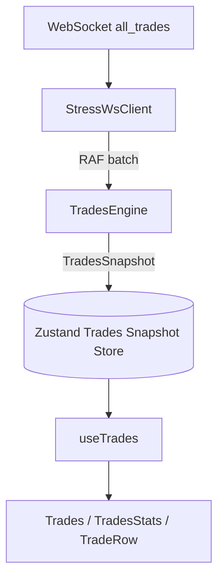

# Trades Panel Rearchitecture Plan

Migrate the current WebSocket → worker → Zustand → React trades pipeline into a production-grade, high-frequency trades feed architecture aligned with the order book engine pattern: tick processing off the render path, snapshot-only store, and virtualization-friendly stable row references.

---

## Table of Contents

1. [Goal](#goal)
2. [Current Architecture](#current-architecture)
3. [Current Problems](#current-problems)
4. [Target Architecture](#target-architecture)
5. [Target Directory Layout](#target-directory-layout)
6. [Layer Responsibilities](#layer-responsibilities)
7. [Migration Phases](#migration-phases)
8. [Expected Performance Impact](#expected-performance-impact)
9. [Final Runtime Flow](#final-runtime-flow)
10. [Acceptance Criteria](#acceptance-criteria)

---

## Goal

| Requirement | Target |
|-------------|--------|
| Update rate | 200+ trades/sec sustained (stress server) |
| Main-thread work | Rendering + virtualization + scroll UX only |
| GC pressure | Bounded ring buffer; no full-array spread per tick |
| React rerenders | One per RAF frame per symbol (trades list + stats bar) |
| Row stability | Stable `Trade` references for unchanged rows |
| Aggregation | Correct 100 ms same-price merge across batches |
| Scalability | Worker-ready engine boundary (extend existing worker) |

**Parity with order book:** same layering — `StressWsClient` → `TradesEngine` → snapshot Zustand → `useTrades` → memoized virtualized rows.

---

## Current Architecture

### Current Flow

```txt
WebSocket (all_trades)
   ↓
StressWsClient.route() — RAF batching per message type (good)
   ↓
Trades.tsx handler — parse wire → Trade[], group by symbol
   ↓
dispatchToTradesWorker(symbol, trades)  ← per-batch worker post
   ↓
aggregate.worker.ts — aggregateTrades(batch only)
   ↓
addTrades(symbol, aggregated) — Zustand: [...incoming, ...prev].slice(0, 500)
   ↓
React rerender (Trades subscribes to bySymbol[symbol].trades)
   ↓
TradesStats — setInterval 1 Hz: filter 60s window + reduce in React
   ↓
TradeRow — isLarge = price * size >= threshold computed per virtual row in render
```

### Current File Map

| Layer | Path | Role today |
|-------|------|------------|
| WS client | `src/lib/stress-ws/client.ts` | Connect, batch, demux |
| WS handler | `src/features/trades/components/Trades.tsx` | Subscribe, parse, `dispatchToTradesWorker` |
| Worker bridge | `src/lib/stress-ws/batcher.ts` | Lazy worker, `postMessage` / `onmessage` |
| Worker | `src/lib/trades/aggregate.worker.ts` | `aggregateTrades` on **incoming batch only** |
| Aggregation | `src/lib/trades/aggregate.ts` | 100 ms same-price merge (pure) |
| Actions | `src/lib/stores/trades/trades.actions.ts` | `addTrades`, `clearTrades`, `setStats` (unused) |
| Store | `src/lib/stores/trades/trades.store.ts` | `TradesFeedState { trades, stats }` per symbol |
| UI | `src/features/trades/components/*` | Virtualized list, stats, threshold input |

### Current Data Shapes

```ts
// Wire (WebSocket)
RawTrade = {
  symbol: string;
  price: string | number;
  size: string | number;
  timestamp: number;      // microseconds
  buyer_role?: string;    // 'taker' → buy
}

// Store (Zustand) — today
TradesFeedState = {
  trades: Trade[];        // newest-first, max 500
  stats: RollingStats | null;  // defined but not written by pipeline
}

// Domain (features/trades/types.ts)
Trade = {
  id: string;
  timestamp: number;
  price: number;
  size: number;
  side: 'buy' | 'sell';
  aggregatedCount?: number;
  isLarge?: boolean;      // unused in store path today
}
```

### Order Book Reference (target pattern)

The order book has already moved toward:

```txt
l2_orderbook → OrderBookEngine.process() → setSnapshot() → useOrderBook()
```

Trades should mirror:

```txt
all_trades → TradesEngine.process() → setTradesSnapshot() → useTrades()
```

See [`ORDERBOOK_REARCHITECTURE.md`](./ORDERBOOK_REARCHITECTURE.md) and implemented engine under `src/features/orderbook/engine/`.

---

## Current Problems

### 1. Wire Parsing and Subscription in UI

`Trades.tsx` owns subscribe/unsubscribe, message parsing, and side inference. This couples transport to presentation and prevents multi-consumer reuse (e.g. future tape export, alerts).

---

### 2. Per-Batch Aggregation (Correctness Gap)

`aggregate.worker.ts` runs `aggregateTrades` on **only the RAF batch**, then `addTrades` prepends to the store.

**Impact:** two trades at the same price within 100 ms but in **different batches** are not merged. Product requirement (§7.3 in `REALTIME_DASHBOARD_PLAN.md`) expects aggregation over the visible feed, not per flush.

---

### 3. Zustand Used as Tick Transport

`addTrades()` spreads the entire `bySymbol` object and rebuilds the trades array every worker reply:

```ts
const trades = [...incoming, ...prev].slice(0, MAX_TRADES);
```

**Impact:** O(n) copy per frame, new array reference every flush, invalidates memoization and virtualization stability.

---

### 4. Rolling Stats in React

`Trades.tsx` runs a 1 Hz `setInterval` that:

- filters `tradesRef.current` for a 60 s window
- reduces buy/sell volume, count, avg size
- calls `setStats` via local `useState` (not the store’s `setStats` action)

**Impact:** stats recompute scans up to 500 trades on the main thread every second; logic belongs in the engine with an incremental deque (per dashboard plan §7.7).

---

### 5. `isLarge` Computed in Render

```tsx
<TradeRow
  trade={trades[vItem.index]}
  isLarge={trades[vItem.index].price * trades[vItem.index].size >= thresholdNum}
/>
```

**Impact:** redundant work per visible row per render; threshold changes force full list reconsideration in render instead of engine snapshot refresh.

---

### 6. Unstable Row References

Each `addTrades` produces a new array and new spread objects from `aggregateTrades` (`buildRow` returns `{ ...anchor, size, aggregatedCount }`).

**Impact:** `React.memo(TradeRow)` provides limited benefit.

---

### 7. Split Brain: Worker vs Engine

Aggregation lives in `lib/trades/` while feature code lives in `features/trades/`. Order book consolidated under `features/orderbook/engine/`. Trades should follow the same colocation for a clear hot-path boundary.

---

### 8. Unused Store Fields

`TradesFeedState.stats` and `setStats` in actions are never updated by the live pipeline. Stats are duplicated in component state.

---

## Target Architecture

### Desired Flow

```txt
WebSocket
   ↓
StressWsClient RAF batching (unchanged)
   ↓
TradesEngine.process(messages)
   ↓
normalize wire → Trade deltas
   ↓
append to per-symbol ring buffer (mutable)
   ↓
incremental / tail aggregation (100 ms window)
   ↓
update rolling-stats deque + 1 Hz snapshot fields
   ↓
apply large-trade threshold → row flags
   ↓
Single Zustand snapshot update (once per RAF frame)
   ↓
React render only (virtualized list + stats bar)
```

### Architecture Diagram



### Shared Tick Ingestion (Future)

Long term, both panels can share the same demux entry without duplicating handlers:

```txt
StressWsProvider (or app-level wiring)
  ├─ l2_orderbook  → OrderBookEngine
  └─ all_trades    → TradesEngine
```

Phase 1 keeps subscribe lifecycle in `Trades.tsx` (same as current `OrderBook.tsx`) for minimal churn; relocate in a later phase.

---

## Target Directory Layout

```txt
src/features/trades/
  engine/
    TradesEngine.ts           # Orchestrator: process(), getSnapshot(), clear()
    types.ts                  # RawTrade, Trade, TradesSnapshot, RollingStats
    normalization.ts          # wire → Trade (side, id, numeric fields)
    aggregation.ts            # 100 ms same-price merge (port from lib/trades/aggregate.ts)
    ring-buffer.ts            # fixed-capacity newest-first buffer (mutable)
    rolling-stats.ts            # time-indexed deque, prune on insert, 1 Hz rollups
    large-trade.ts            # notional threshold → isLarge on rows
  store/
    trades.store.ts           # TradesSnapshot per symbol only
    trades.actions.ts         # setTradesSnapshot, clearTradesSnapshot
  hooks/
    useTrades.ts              # symbol → snapshot selector
    useTradesStats.ts         # optional narrow selector for stats bar only
  components/                 # simplified surface
    Trades.tsx                # subscribe + render; no processing
    TradeRow.tsx
    TradesStats.tsx
  types.ts                    # re-export public types from engine/types.ts
```

**Deprecate / remove after migration:**

- `src/lib/stores/trades/*` → move to `features/trades/store/`
- `src/lib/trades/aggregate.ts` → `features/trades/engine/aggregation.ts`
- `src/lib/trades/aggregate.worker.ts` → fold into engine worker or engine main thread first
- `src/lib/stress-ws/batcher.ts` → engine-owned worker dispatch (or inline until profiling)

---

## Layer Responsibilities

### WebSocket Layer (`StressWsClient`)

**ONLY:**

- connect / reconnect
- subscribe / unsubscribe
- route messages
- RAF batch per channel type

**MUST NOT:**

- parse trade side
- aggregate trades
- maintain ring buffers or rolling windows

---

### Trades Engine

**OWNS:**

- wire normalization (`buyer_role` → side, µs timestamps)
- per-symbol ring buffer (cap 500, evict oldest)
- 100 ms same-price aggregation (full buffer or incremental tail merge)
- rolling 60 s stats deque + periodic rollup
- large-trade flagging when threshold changes
- stable row references where possible
- `TradesSnapshot` construction

**INTERNAL STATE (mutable):**

```ts
interface SymbolState {
  buffer: Trade[];              // newest-first, fixed capacity
  aggregated: Trade[];          // display list, reused slots where possible
  statsDeque: StatsEntry[];     // { ts, size, side, notional }
  lastStatsRollup: RollingStats | null;
  lastStatsTick: number;        // ms, for 1 Hz UI refresh
}

class TradesEngine {
  private readonly symbols = new Map<TradingSymbol, SymbolState>();
  private largeTradeThreshold = 10_000;

  process(messages: RawTrade[]): void { /* normalize + append + aggregate */ }
  setLargeTradeThreshold(n: number): void { /* re-flag rows, re-snapshot */ }
  getSnapshot(symbol: TradingSymbol): TradesSnapshot | null { /* ... */ }
  clear(symbol: TradingSymbol): void { /* reset + clear store */ }
}
```

**Snapshot shape (render-ready):**

```ts
type TradesSnapshot = {
  symbol: TradingSymbol;
  trades: Trade[];              // stable array ref when possible
  stats: RollingStats | null; // updated at most 1 Hz
  largeTradeThreshold: number;
};
```

**Important rule:** engine internals are **mutable**. Avoid `[...prev, ...incoming]` in the hot path; mutate ring buffer indices or doubly-linked deque.

---

### Zustand

**ONLY stores** the latest **processed snapshot** per symbol:

```ts
type TradesSnapshotStore = {
  snapshots: Partial<Record<TradingSymbol, TradesSnapshot | null>>;
};
```

**Update rule:** at most **one `setState` per symbol per RAF frame** after engine processing. Stats fields may be unchanged between frames — shallow-compare `stats` before including in snapshot if needed.

---

### React

**ONLY:**

- subscribe via `useTrades(focusedSymbol)`
- render virtualized list (`@tanstack/react-virtual`)
- threshold input → `engine.setLargeTradeThreshold` (debounced / deferred)
- scroll UX: pin-to-bottom, jump to latest
- symbol focus lifecycle: subscribe / unsubscribe / clear

**MUST NOT:**

- parse WebSocket payloads (after Phase 4+)
- run `aggregateTrades` or 60 s window filters
- compute `isLarge` per row in render

---

## Migration Phases

### Phase 1 — Create Trades Engine Scaffold

**Tasks:**

- [ ] Add `features/trades/engine/` module structure
- [ ] Define `types.ts` (`RawTrade`, `Trade`, `TradesSnapshot`, `RollingStats`)
- [ ] Implement `TradesEngine` with `process()`, `clear()`, `getSnapshot()`
- [ ] Port `aggregateTrades` from `lib/trades/aggregate.ts` into `engine/aggregation.ts`
- [ ] Unit tests: aggregation fixtures (single batch, cross-batch same price within 100 ms, side boundaries)

**Exit criteria:** engine aggregation matches current `aggregate.ts` for full newest-first buffers.

---

### Phase 2 — Ring Buffer Instead of Array Spread

**Before:**

```ts
const trades = [...incoming, ...prev].slice(0, MAX_TRADES);
```

**After:**

```ts
// prepend batch to fixed-capacity buffer in place
ringBuffer.prependMany(incoming);
```

**Tasks:**

- [ ] Implement `ring-buffer.ts` (capacity 500, newest-first indexing)
- [ ] Engine appends normalized trades per message, then runs aggregation on buffer
- [ ] Remove spread-based `addTrades` hot path

**Exit criteria:** no array allocation proportional to 500 on every RAF flush.

---

### Phase 3 — Fix Cross-Batch Aggregation

**Tasks:**

- [ ] Run aggregation on **tail of buffer** after each flush (merge into head row if same price + within 100 ms of newest in group)
- [ ] Or full re-aggregate only when batch size > threshold (correctness first, optimize in Phase 7)
- [ ] Remove per-batch-only worker assumption; worker receives **buffer slice** or incremental op codes

**Exit criteria:** stress test shows same-price bursts across consecutive RAF frames merge to one row with `(count)`.

---

### Phase 4 — Move Wire Handling Out of React (Optional Parity)

**Remove from `Trades.tsx`:**

```ts
// inline parse + dispatchToTradesWorker
```

**Replace with:**

```ts
client.on('all_trades', (messages) => {
  tradesEngine.process(messages);
});
```

**Tasks:**

- [ ] `normalization.ts` — single place for side/id/number coercion
- [ ] Keep subscribe/unsubscribe in `Trades.tsx` initially (matches `OrderBook.tsx` today)
- [ ] `clearTrades` → `engine.clear(symbol)` + snapshot `null`

---

### Phase 5 — Snapshot-Only Zustand Store

**Replace store shape:**

```ts
// Before
bySymbol: Partial<Record<TradingSymbol, TradesFeedState>>

// After
snapshots: Partial<Record<TradingSymbol, TradesSnapshot | null>>
```

**Tasks:**

- [ ] Move store to `features/trades/store/`
- [ ] `setTradesSnapshot(symbol, snapshot)` — once per engine flush
- [ ] Shallow-compare snapshot before `setState`
- [ ] Remove unused `setStats` from public API (stats live inside snapshot)

---

### Phase 6 — Rolling Stats in Engine

**Port plan from `REALTIME_DASHBOARD_PLAN.md` §7.7:**

```ts
on each normalized trade:
  push to statsDeque
  prune while front.ts < now - 60_000

every 1s (engine time, not React interval):
  compute buyVol, sellVol, tradeCount, avgSize
  attach to snapshot.stats
```

**Tasks:**

- [ ] Implement `rolling-stats.ts` with µs-aware timestamps (consistent with `Trades.tsx` cutoff logic)
- [ ] Remove `setInterval` + `tradesRef` stats block from `Trades.tsx`
- [ ] `TradesStats` reads `snapshot.stats` only

**Exit criteria:** stats bar updates at 1 Hz without scanning 500 trades in React.

---

### Phase 7 — Incremental Aggregation (Performance)

**Problem:** full `aggregateTrades(buffer)` every frame is O(n).

**Fix:** only re-walk from index 0 until window boundary stable (new trades only affect head groups).

**Tasks:**

- [ ] Tail-merge: compare incoming trades against `aggregated[0]`
- [ ] Fall back to full aggregation on symbol clear or resync
- [ ] Benchmark vs Phase 3 baseline

---

### Phase 8 — Large Trade Threshold in Engine

**Tasks:**

- [ ] `engine.setLargeTradeThreshold(value)` on deferred input change
- [ ] Set `trade.isLarge` on snapshot rows (or parallel `Uint8Array` flags)
- [ ] `TradeRow` receives `isLarge` from trade object — remove inline notional math
- [ ] Optional: persist threshold to `localStorage` (`dashboard:largeTradeThreshold`)

---

### Phase 9 — Stable Snapshot References

**Tasks:**

- [ ] Reuse `Trade` objects when price/size/side/aggregatedCount unchanged
- [ ] Replace array only when length changes or head row merges
- [ ] Document reference stability for `React.memo(TradeRow)`

**Exit criteria:** React Profiler shows unchanged rows skip render when trade unchanged.

---

### Phase 10 — `useTrades` Hook and Slim Components

**Tasks:**

- [ ] `useTrades(symbol)` — narrow Zustand selector
- [ ] Optional `useTradesStats(symbol)` if stats bar should not rerender on trade-only updates
- [ ] `Trades.tsx` — virtualizer + threshold UI + scroll footer only
- [ ] `getItemKey: (i) => trades[i].id` (or stable composite key)

---

### Phase 11 — Virtualization and Scroll UX Hardening

**Tasks:**

- [ ] Fixed `estimateSize: 28` (matches `h-7`)
- [ ] `isPinnedToBottom` ref — auto-scroll only when pinned (per dashboard plan §7.6)
- [ ] Footer “Jump to latest” sets pinned + `scrollToIndex(0)`
- [ ] `min-h-0` flex chain in parent layout (if not already)

---

### Phase 12 — Web Worker Migration (Future)

**Reuse / replace** `aggregate.worker.ts`:

- normalization (optional)
- aggregation
- rolling-stats prune + rollup

**Main thread retains:**

- rendering
- virtualization
- threshold input
- scroll interactions

**Tasks:**

- [ ] `trades.worker.ts` message protocol (`process` / `snapshot`)
- [ ] Transferable snapshot or structured clone into store
- [ ] Feature flag: `VITE_TRADES_WORKER=true`
- [ ] Remove `lib/stress-ws/batcher.ts` trades-specific bridge

---

## Expected Performance Impact

| Optimization | Expected impact |
|--------------|-----------------|
| Remove stats scan from React | **High** |
| Ring buffer vs array spread | **High** |
| Cross-batch aggregation correctness | **Functional** (required) |
| Snapshot-only Zustand | **High** |
| Stable row references | **Medium–High** |
| Incremental tail aggregation | **Medium** |
| Engine-side `isLarge` | **Low–Medium** |
| Worker migration | **High** at 200+ trades/sec |

---

## Final Runtime Flow

```txt
Socket Tick (all_trades)
    ↓
StressWsClient.route() — buffer + RAF flush
    ↓
TradesEngine.process(messages[])
    ↓
normalize → append to ring buffer
    ↓
aggregate (tail merge or incremental)
    ↓
stats deque push + prune
    ↓
maybe 1 Hz stats rollup into snapshot
    ↓
apply large-trade flags
    ↓
stable TradesSnapshot
    ↓
Zustand setTradesSnapshot (once per frame)
    ↓
useTrades(selector) → React
    ↓
TanStack Virtual → memo(TradeRow)
```

---

## Acceptance Criteria

### Functional

- [ ] Columns: time, price, size, side coloring unchanged
- [ ] Same-price trades within 100 ms merge with `(count)` — **including across RAF batches**
- [ ] Ring buffer caps at 500 rows; oldest evicted
- [ ] Large trade highlight respects user threshold (default $10,000 notional)
- [ ] Rolling 60 s stats: buy vol, sell vol, trade count, avg size — 1 Hz UI refresh
- [ ] Focus switch clears trades and resubscribes without stale flash
- [ ] Auto-scroll / jump-to-latest behavior preserved

### Performance

- [ ] No aggregation or 60 s filtering in React render path
- [ ] ≤ 1 Zustand commit per symbol per animation frame under stress load
- [ ] React Profiler: unchanged trade rows do not rerender
- [ ] Main thread stable with stress server `all_trades` 1–5 ms interval (per `REALTIME_DASHBOARD_PLAN.md`)

### Architecture

- [ ] WebSocket client has zero trades business logic
- [ ] Engine is unit-testable without React
- [ ] Store exposes processed snapshots only
- [ ] Clear boundary for worker extraction (aligned with order book Phase 12)
- [ ] Feature layout mirrors `features/orderbook/engine|store|hooks`

---

## Migration Order Summary

| Phase | Focus | Risk |
|-------|-------|------|
| 1 | Engine scaffold + aggregation tests | Low |
| 2 | Ring buffer | Low |
| 3 | Cross-batch aggregation | Medium |
| 4 | Wire handler relocation | Medium |
| 5 | Snapshot store | Low |
| 6 | Rolling stats in engine | Medium |
| 7 | Incremental aggregation | Medium |
| 8–9 | Large trade + stable refs | Low |
| 10–11 | React + virtualizer + scroll | Low |
| 12 | Worker | High (optional) |

**Recommended approach:** phases 1–5 first (correctness + remove render/store hot path), then 6 (stats), then 7–9 (performance), then 10–11 (polish), then 12 when profiling demands it.

---

## Related Documents

- [`ORDERBOOK_REARCHITECTURE.md`](./ORDERBOOK_REARCHITECTURE.md) — parallel engine/snapshot pattern (reference implementation)
- [`REALTIME_DASHBOARD_PLAN.md`](./REALTIME_DASHBOARD_PLAN.md) — trades requirements (§7), performance targets (§8)
- [`README.md`](./README.md) — setup and stress-server usage

---

*Last updated: aligned with codebase state — WS handler in `Trades.tsx`, per-batch worker aggregation, `addTrades` array spread, stats via React `setInterval`, order book engine at `features/orderbook/engine/`.*
