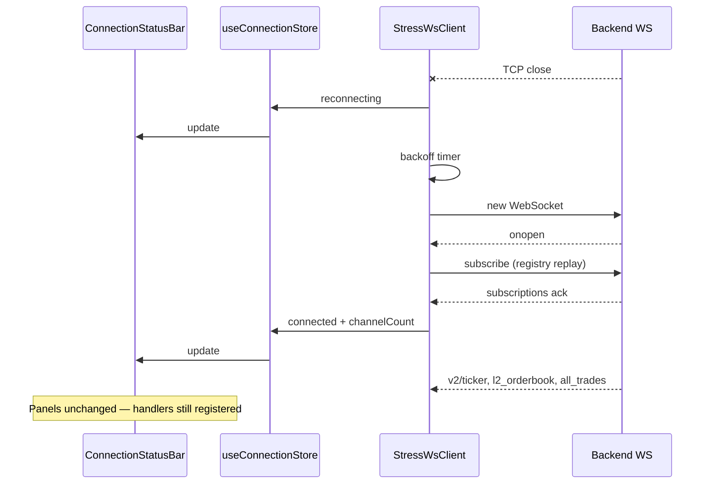

# WebSocket connection & recovery — minimal plan

Two assignment requirements:

1. **Automatic reconnection** — exponential backoff, visible status (`connected` / `reconnecting` / `disconnected`), re-subscribe all active channels on reconnect.
2. **Backend stop/restart** — UI recovers without a page refresh.

Target UI (top bar):

```
● Connected · 8 channels · ws://localhost:8080
```

---

## Current state (already in repo)

Most of the plumbing exists; this is not a greenfield build.

| Piece | Location | What it does |
|-------|----------|--------------|
| WS client singleton | `src/lib/stress-ws/client.ts` | Connect, backoff (`min(1000 × 2^attempt, 30s)` + jitter), subscription registry, `flushSubscription()` on `onopen` |
| Status types | `src/lib/stress-ws/types.ts` | `connecting` \| `connected` \| `reconnecting` \| `disconnected` |
| Connection store | `src/lib/stores/connection/` | Zustand mirror of last status update |
| Lifecycle hook | `src/App.tsx` (and `StressWsProvider.tsx`) | `onStatus` → `updateConnection`, `connect(WS_URL)` on mount |
| Panel subscriptions | `TickerBar`, `OrderBook`, `Trades` | `subscribe()` on mount → entries land in client registry |

**Reconnect replay:** Panels call `subscribe(channel, symbols)`; the client keeps `Map<channel, Set<symbol>>`. On every successful `onopen`, `flushSubscription()` sends one merged `subscribe` message — no panel code needed on reconnect.

**Connected signal:** Backend ack `{ type: "subscriptions", payload: { channels } }` → `emitStatus('connected', channels.length)`.

---

## Gaps (small, explicit)

| Gap | Impact | Fix (minimal) |
|-----|--------|----------------|
| No status bar UI | Requirement not visible | One `ConnectionStatusBar` component |
| Status may lag after socket close | Bar can show “Connected” during backoff | Emit `reconnecting` in `onclose` (before `scheduleReconnect`) |
| Duplicate lifecycle | `App.tsx` and `StressWsProvider` both connect | Pick one entry point (provider **or** `App` effect — not both) |
| `connecting` not shown in wireframe | Minor | Map `connecting` → same styling as `reconnecting` in the bar |

**Out of scope (keep engineering minimal):**

- Retry caps / “give up” UI
- Calling backend config API (`:3000/intervals`)
- Clearing order book / trades stores on disconnect (stale snapshot until first post-reconnect message is acceptable)
- Zod validation of WS payloads for this task
- Separate reconnect logic per panel

---

## Implementation plan

### Step 1 — Status bar (~30 lines)

**File:** `src/components/ConnectionStatusBar.tsx`

- Subscribe with `useConnectionStore` to `status`, `channelCount`, `wsUrl`.
- Render: colored dot + label + `· N channels · {wsUrl}`.
- Styles (match wireframe / existing tokens):

| Status | Dot + label |
|--------|-------------|
| `connected` | Green — “Connected” |
| `reconnecting`, `connecting` | Amber — “Reconnecting…” |
| `disconnected` | Red — “Disconnected” |

- `channelCount`: show backend ack count when connected; show `—` or last known count when not connected (either is fine).

**Wire:** Add `<ConnectionStatusBar />` at the top of `App` layout (above `TickerBar`).

### Step 2 — One lifecycle owner

- Use **either** `StressWsProvider` wrapping the app **or** the existing `useEffect` in `App.tsx` — remove the duplicate.
- Prefer provider if you want tests/storybook isolation later; otherwise keeping `App.tsx` only is fewer files.

No changes to `TickerBar` / `OrderBook` / `Trades` subscription effects.

### Step 3 — Tiny client tweak (optional but recommended)

In `StressWsClient`, on `ws.onclose` (when not `destroyed`):

```ts
this.emitStatus('reconnecting', 0); // or keep last channelCount
this.scheduleReconnect();
```

Ensures the bar updates immediately when the backend dies, not only when the backoff timer fires.

### Step 4 — Verify backend restart (manual test)

Prereq: stress WS on `ws://localhost:8080`, app on dev server.

| Step | Action | Expected |
|------|--------|----------|
| 1 | Load dashboard | Bar: **Connected**, channel count > 0, live ticker/book/trades |
| 2 | Stop WS process | Bar: **Reconnecting…** (then backoff retries) |
| 3 | Wait 5–10 s | Panels may freeze on last snapshot; no crash |
| 4 | Start WS again | Bar: **Connected**; data resumes within ~1–3 s |
| 5 | No browser refresh | Subscriptions restored via registry; tickers + focused book/trades update |

**Pass criteria:** Same as assignment metric — full resubscribe + UI recovery **&lt; 3 s** after backend is back, without reload.

---

## Data flow (reconnect)



---

## Files touched (estimate)

| File | Change |
|------|--------|
| `src/components/ConnectionStatusBar.tsx` | **New** |
| `src/App.tsx` | Mount bar; dedupe WS lifecycle |
| `src/lib/stress-ws/client.ts` | ~2 lines: emit `reconnecting` on close |

**Total:** ~1 new component, ~1 small client edit, layout wiring. No store schema changes.

---

## Checklist

- [ ] `ConnectionStatusBar` shows three visual states
- [ ] Single `connect()` on app mount
- [ ] `reconnecting` emitted as soon as socket closes (optional tweak)
- [ ] Kill backend → restart → connected + live data without refresh
- [ ] Channel count matches ack after reconnect (e.g. 8 = 6 tickers + book + trades for one symbol)
