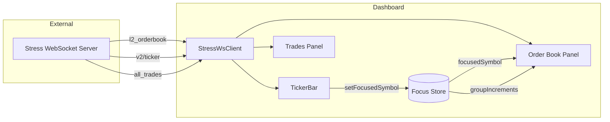
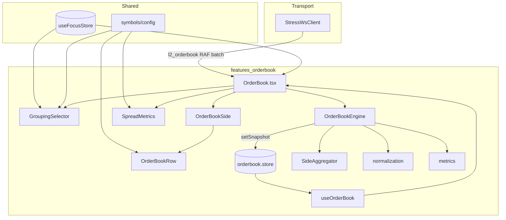
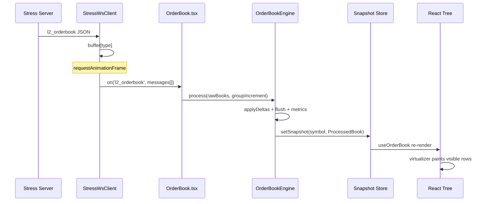
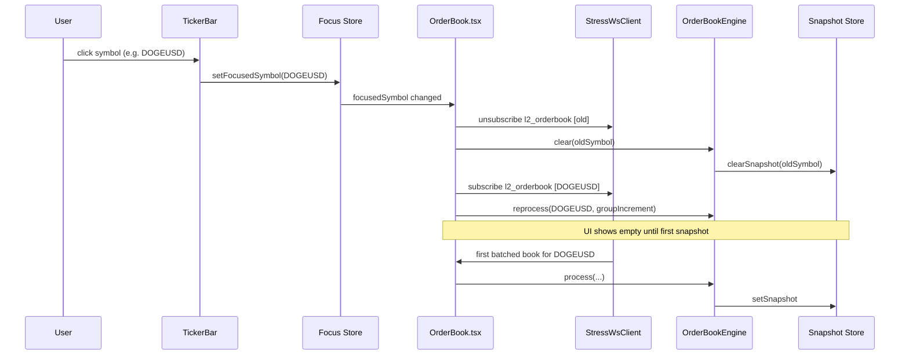
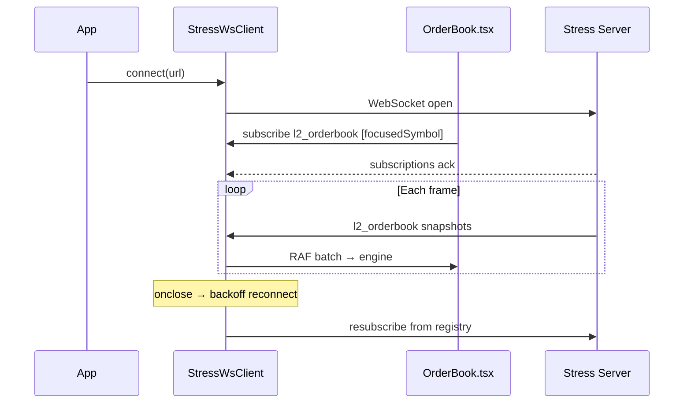
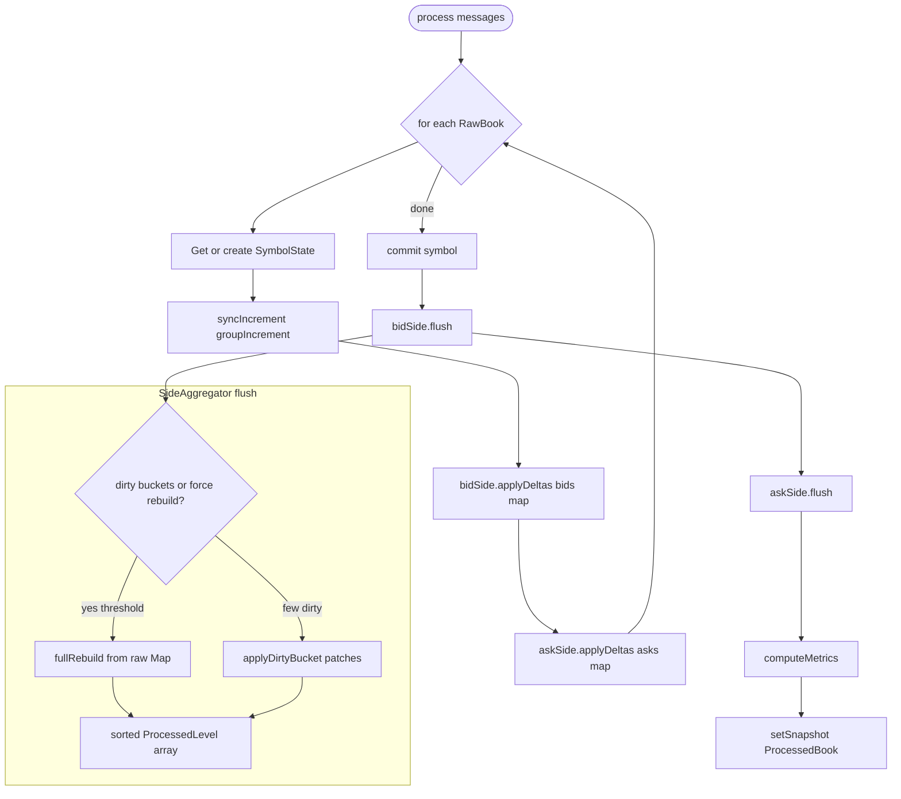
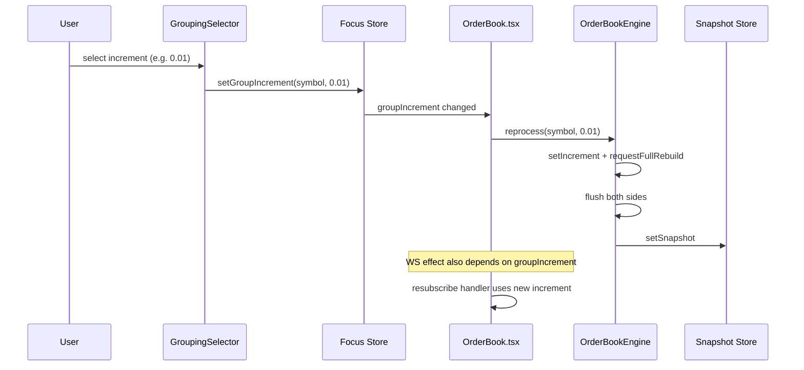

# Order Book Panel — Architecture

Local architecture reference for the **Live Order Book** panel (`l2_orderbook`). Derived from [`ORDERBOOK_REARCHITECTURE.md`](../../../ORDERBOOK_REARCHITECTURE.md) and [`REALTIME_DASHBOARD_PLAN.md`](../../../REALTIME_DASHBOARD_PLAN.md) §6.

---

## Table of Contents

1. [Goals](#goals)
2. [HLD — System Context](#hld--system-context)
3. [HLD — Dashboard Integration Flow](#hld--dashboard-integration-flow)
4. [Component Communication Diagrams](#component-communication-diagrams)
5. [HLD — Component View](#hld--component-view)
6. [HLD — End-to-End Data Flow](#hld--end-to-end-data-flow)
7. [HLD — Sequence Flows](#hld--sequence-flows)
8. [HLD — Engine Processing Flow](#hld--engine-processing-flow)
9. [HLD — Grouping Change Flow](#hld--grouping-change-flow)
10. [Runtime Flow](#runtime-flow)
11. [Directory Layout](#directory-layout)
12. [Layer Responsibilities](#layer-responsibilities)
13. [Data Model](#data-model)
14. [Grouping & Aggregation](#grouping--aggregation)
15. [Symbol Configuration](#symbol-configuration)
16. [UI Composition](#ui-composition)
17. [Subscription Lifecycle](#subscription-lifecycle)
18. [Performance Model](#performance-model)
19. [Implementation Status](#implementation-status)
20. [Related Documents](#related-documents)

---

## Goals

| Requirement | Target |
|-------------|--------|
| Update rate | 50–100 ms full snapshots per symbol (stress server) |
| Main-thread work | Rendering + virtualization only |
| React rerenders | ≤ 1 per RAF frame per focused symbol |
| Grouping | Symbol-adaptive price buckets (BTC → DOGE precision) |
| Depth UX | Cumulative size bars, spread metrics, stable row height |
| Scalability | Engine boundary isolates hot-path logic from React |

---

## HLD — System Context

The order book panel is one of three real-time surfaces on the dashboard. It consumes **only the focused symbol** on `l2_orderbook`; the ticker strip always receives `v2/ticker` for all six symbols.



| Boundary | Responsibility |
|----------|----------------|
| Stress server | Publishes full L2 snapshots per symbol |
| `StressWsClient` | Transport, reconnect, RAF batching |
| Order book panel | Subscribe, engine, render depth + metrics |
| Focus store | Active symbol + per-symbol grouping preference |

---

## HLD — Dashboard Integration Flow

Single view of how the **order book** fits with the ticker, trades panel, shared WebSocket, and focus store (see [`App.tsx`](../../../App.tsx)). See [Component Communication Diagrams](#component-communication-diagrams) for rendered figures.

---

## Component Communication Diagrams

### Dashboard (all panels)


*Source file:* [`docs/architecture/dashboard-integration.svg`](../../../docs/architecture/dashboard-integration.svg)

### Order book panel (detail)


*Source file:* [`assets/component-communication.svg`](./assets/component-communication.svg)

Layers: **Transport** → **Panel** (`OrderBook.tsx`) → **Engine** → **Zustand snapshot** → **Virtualized view**.

```mermaid
flowchart TB
  subgraph User
    U[Trader]
  end

  subgraph UI["Dashboard UI"]
    CSB[ConnectionStatusBar]
    TB[TickerBar]
    OB["Order Book Panel<br/>l2_orderbook"]
    TR["Trades Panel<br/>all_trades"]
  end

  subgraph State
    FS[(useFocusStore<br/>focusedSymbol<br/>groupIncrements)]
    CS[(connection.store)]
  end

  subgraph Transport
    WS[StressWsClient<br/>RAF batch per channel]
  end

  subgraph Engines
    OBE[OrderBookEngine]
    TRE[TradesEngine]
  end

  subgraph Stores
    OBS[(orderbook snapshots)]
    TRS[(trades snapshots)]
    TKS[(ticker store)]
  end

  SS[(Stress WS Server)]

  U -->|click symbol| TB
  TB -->|setFocusedSymbol| FS
  U -->|change grouping| OB
  OB -->|setGroupIncrement| FS

  SS <-->|WebSocket| WS
  WS -->|onStatus| CS
  CS --> CSB

  WS -->|v2/ticker all 6 symbols| TB
  TB --> TKS

  FS -->|focusedSymbol| OB
  FS -->|focusedSymbol| TR
  FS -->|groupIncrement| OBE

  WS -->|l2_orderbook RAF| OB
  OB --> OBE
  OBE --> OBS
  OBS --> OB

  WS -->|all_trades RAF| TR
  TR --> TRE
  TRE --> TRS
  TRS --> TR

  style OB fill:#1a2e1a
  style OBE fill:#1a2e1a
```

<details>
<summary>Mermaid source (dashboard integration)</summary>



</details>

**Subscription rules:**

| Channel | Symbols subscribed | Updated by |
|---------|-------------------|------------|
| `v2/ticker` | All 6 (`BTCUSD` … `DOGEUSD`) | `TickerBar` on mount |
| `l2_orderbook` | **Focused symbol only** | `OrderBook.tsx` effect |
| `all_trades` | **Focused symbol only** | `Trades.tsx` effect |

**On symbol change:** both panels unsubscribe the old symbol, clear engine state + snapshot, then subscribe the new symbol in parallel.

---

## HLD — Component View



---

## HLD — End-to-End Data Flow

```mermaid
flowchart TD
  A[WS: l2_orderbook message] --> B[StressWsClient buffers by type]
  B --> C{RAF flush}
  C --> D[OrderBook handler: RawBook[]]
  D --> E[OrderBookEngine.process]
  E --> F[Update raw Maps bids/asks]
  F --> G[SideAggregator.flush]
  G --> H[Bucket + sort + running totals]
  H --> I[computeMetrics]
  I --> J[ProcessedBook snapshot]
  J --> K[Zustand setSnapshot]
  K --> L[useOrderBook selector]
  L --> M[Virtualized OrderBookSide]
  M --> N[OrderBookRow + depth bar]
```

**Data shape transitions:**

```txt
Wire          RawBook           Engine internal      Store / UI
────────      ───────           ───────────────      ──────────
[price,size]  RawLevel[]    →   Map<price,size>  →   ProcessedLevel[]
per side      per symbol        per side             { price, size, total }
```

---

## HLD — Sequence Flows

### Tick ingest (steady state)



### Symbol focus change



### App mount + reconnect



---

## HLD — Engine Processing Flow



**Bucket logic (per level):**

```txt
bid: bucket = floor(price / increment) × increment
ask: bucket = ceil(price / increment) × increment
     → sum sizes per bucket
     → sort (asks asc, bids desc)
     → cumulative total from touch outward
```

---

## HLD — Grouping Change Flow



---

## Runtime Flow

```txt
WebSocket (l2_orderbook)
   ↓
StressWsClient.route()
   · buffer messages per type
   · flush handlers once per requestAnimationFrame
   ↓
OrderBook.tsx — subscribe focused symbol
   · build RawBook[] from batched messages
   · OrderBookEngine.process(messages, groupIncrement)
   ↓
OrderBookEngine (singleton)
   · per-symbol Map<price, size> for bids / asks
   · SideAggregator: bucket → sort → running totals
   · computeMetrics → ProcessedBook
   ↓
setSnapshot(symbol, ProcessedBook)  →  Zustand (snapshots only)
   ↓
useOrderBook(symbol)  →  React
   ↓
OrderBookSide (@tanstack/react-virtual)  →  memo(OrderBookRow)
```

---

## Directory Layout

```txt
src/features/orderbook/
  ARCHITECTURE.md          ← this file
  index.ts                 # public exports
  types.ts                 # UI-facing types (Side, GroupIncrement)
  components/
    OrderBook.tsx          # WS subscribe, engine wiring, layout shell
    OrderBookSide.tsx      # virtualized ask/bid columns
    OrderBookRow.tsx       # price / size / total + depth bar
    SpreadMetrics.tsx      # mid, spread, imbalance
    GroupingSelector.tsx   # symbol-adaptive group buttons
  engine/
    OrderBookEngine.ts     # orchestrator: process, reprocess, clear
    types.ts               # RawBook, ProcessedLevel, ProcessedBook
    normalization.ts       # applyDelta (wire → Map)
    aggregation.ts         # bucketPrice, SideAggregator
    metrics.ts             # mid, spread, spreadBps, imbalance, max totals
  store/
    orderbook.store.ts     # ProcessedBook snapshots per symbol
    orderbook.actions.ts   # setSnapshot, clearSnapshot
  hooks/
    useOrderBook.ts        # Zustand selector for one symbol
  data/
    dummy.ts               # static fixture (dev / story)
```

**Legacy (deprecate):**

- `src/lib/orderbook/group.ts` — original `processBook()`; logic ported into `engine/`
- `src/lib/stores/orderbook/*` — old normalised-book Zustand path (if still present)

---

## Layer Responsibilities

### WebSocket (`src/lib/stress-ws/client.ts`)

**Owns:** connect, reconnect, subscribe registry, per-type RAF batching, handler demux.

**Must not:** normalize books, bucket prices, compute spread.

### Order Book Engine (`engine/OrderBookEngine.ts`)

**Owns:**

- Per-symbol mutable state: `bids` / `asks` as `Map<number, number>`
- Group increment per symbol session (`syncIncrement`)
- `SideAggregator` for bid (floor buckets, desc sort) and ask (ceil buckets, asc sort)
- Running cumulative totals per side
- Render-ready `ProcessedBook` emission

**API:**

| Method | Purpose |
|--------|---------|
| `getInstance()` | Singleton engine |
| `process(messages, groupIncrement)` | Apply WS batch for focused increment |
| `reprocess(symbol, groupIncrement)` | Full regroup after user changes grouping |
| `clear(symbol)` | Drop engine state + store snapshot |

**Internal state:**

```ts
interface SymbolState {
  bids: Map<number, number>;
  asks: Map<number, number>;
  bidSide: SideAggregator;
  askSide: SideAggregator;
  lastIncrement: number;
}
```

### Zustand (`store/`)

**Only** processed snapshots:

```ts
type OrderBookSnapshotState = {
  snapshots: Partial<Record<TradingSymbol, ProcessedBook | null>>;
};
```

One `setSnapshot` per engine commit — no raw/normalised book in public store.

### React (`components/` + `hooks/`)

**Owns:** layout, virtualization, grouping UI, symbol labels.

**Must not:** call `processBook()` in render; must not merge WS payloads in render.

**Focus store** (`src/lib/stores/focus/`):

- `focusedSymbol` — drives WS subscription
- `groupIncrements` — persisted per symbol (`dashboard:focus` via zustand/persist)

---

## Data Model

### Wire (WebSocket)

```ts
type RawLevel = [price: string, size: string];

type RawBook = {
  symbol: TradingSymbol;
  bids: RawLevel[];
  asks: RawLevel[];
};
```

Stress backend sends **full snapshots** (~500 levels per side) each message. See [`REALTIME_DASHBOARD_PLAN.md`](../../../REALTIME_DASHBOARD_PLAN.md) §3.2.

### Engine internal

```ts
// Raw side maps (price → size)
Map<number, number>

// After aggregation
type ProcessedLevel = {
  price: number;   // bucket price
  size: number;    // summed size in bucket
  total: number;   // cumulative from touch outward
};

type ProcessedBook = {
  symbol: TradingSymbol;
  bids: ProcessedLevel[];
  asks: ProcessedLevel[];
  maxBidTotal: number;
  maxAskTotal: number;
  mid: number;
  spread: number;
  spreadBps: number;
  imbalance: number;
};
```

---

## Grouping & Aggregation

### Symbol-adaptive increments

Configured in `src/lib/symbols/config.ts`:

| Symbol | Price precision | Group options |
|--------|-----------------|---------------|
| BTCUSD | 1 dp | 1, 5, 10, 50, 100, 500 |
| ETHUSD | 2 dp | 0.50, 1, 5, 10, 50 |
| XRPUSD | 4 dp | 0.0001, 0.001, 0.01, 0.1 |
| SOLUSD | 4 dp | 0.01, 0.1, 0.5, 1, 5 |
| PAXGUSD | 2 dp | 0.50, 1, 5, 10, 50 |
| DOGEUSD | 6 dp | 0.000001, 0.00001, 0.0001, 0.001, 0.01 |

Helpers: `getGroupOptions`, `resolveGroupIncrement`, `isValidGroupIncrement`.

### Bucket formula

Implemented in `engine/aggregation.ts`:

```txt
bid bucket = floor(price / increment) * increment
ask bucket = ceil(price / increment)  * increment
```

Aggregate sizes per bucket, then:

- Sort asks ascending (best ask nearest mid)
- Sort bids descending (best bid nearest mid)
- Running total from touch outward for depth column

### Metrics (`engine/metrics.ts`)

From **grouped** touch prices:

```txt
bestAsk = asks[0].price
bestBid = bids[0].price
mid     = (bestAsk + bestBid) / 2
spread  = bestAsk - bestBid
spreadBps = mid ? (spread / mid) * 10_000 : 0
imbalance = totalBidSize / totalAskSize   // bid vol / ask vol
```

### SideAggregator strategy

| Mode | When |
|------|------|
| Full rebuild | First snapshot, increment change, dirty count > threshold |
| Dirty bucket patch | Small number of changed buckets per frame |

`FULL_REBUILD_DIRTY_THRESHOLD = 32` — above this, full regroup is cheaper than patching.

---

## Symbol Configuration

`src/lib/symbols/config.ts` drives:

- `GroupingSelector` options and labels (`formatGroupIncrementLabel`)
- `OrderBookRow` / `SpreadMetrics` price formatting (`formatPriceWithPrecision`)
- `OrderBookSide` column headers (`Size (BTC)` → `Size (DOGE)` via `baseName`)

---

## UI Composition

```txt
OrderBook
├── header: title, LIVE badge, GroupingSelector
├── OrderBookSide (ask) — virtual list, red prices right
├── SpreadMetrics — mid / spread / imbalance
└── OrderBookSide (bid) — virtual list, green prices left
```

### OrderBookRow

- Fixed height `h-6` (24px) for virtualizer `estimateSize`
- Depth bar: `transform: scaleX(total / maxTotal)` — no width animation
- Prices use symbol `pricePrecision`

### Virtualization

`OrderBookSide` uses `@tanstack/react-virtual`:

- `getItemKey: (i) => levels[i].price`
- `overscan: 3`
- Parent scroll container `h-96 overflow-y-auto`

---

## Subscription Lifecycle

Tied to **focused symbol** from ticker strip:

```txt
User selects symbol in TickerBar
   → setFocusedSymbol(symbol)
   → OrderBook effect: unsubscribe old, engine.clear(old)
   → subscribe l2_orderbook [newSymbol]
   → engine.reprocess when groupIncrement resolves for symbol

User changes grouping
   → setGroupIncrement(symbol, value)  (persisted)
   → engine.reprocess(symbol, increment)
   → WS handler uses new increment on next RAF batch
```

Only the **focused** symbol receives `l2_orderbook` subscription (bandwidth control per dashboard plan §3.3).

---

## Performance Model

| Stage | Complexity | Notes |
|-------|------------|-------|
| WS batch | O(messages) | RAF coalesces to ~60 Hz |
| Map update | O(levels) per message | Up to ~1000 levels |
| Full regroup | O(levels) | On rebuild path |
| Dirty regroup | O(dirty buckets) | On patch path |
| Zustand commit | O(1) | One snapshot per symbol per frame |
| React | O(visible rows) | Virtualizer window |

**Anti-patterns (avoid):**

- `processBook()` inside React render
- `setBook()` to Zustand on every tick with intermediate shapes
- New `ProcessedLevel` objects for unchanged buckets every frame

---

## Implementation Status

| Item | Status |
|------|--------|
| OrderBookEngine + snapshot store | Done |
| SideAggregator + dirty/full rebuild | Done |
| `useOrderBook` hook | Done |
| Virtualized sides + depth bars | Done |
| Symbol-adaptive grouping UI | Done |
| Precision-aware price display | Done |
| Remove render-time `processBook` | Done |

---

## Related Documents

| Document | Scope |
|----------|--------|
| [`ORDERBOOK_REARCHITECTURE.md`](../../../ORDERBOOK_REARCHITECTURE.md) | Full migration plan and acceptance criteria |
| [`REALTIME_DASHBOARD_PLAN.md`](../../../REALTIME_DASHBOARD_PLAN.md) | Product requirements §6 (order book) |
| [`TRADES_REARCHITECTURE.md`](../../../TRADES_REARCHITECTURE.md) | Parallel panel pattern |
| [`src/features/trades/ARCHITECTURE.md`](../trades/ARCHITECTURE.md) | Trades panel HLD |
| [`WS_CONNECTION_RECOVERY_PLAN.md`](../../../WS_CONNECTION_RECOVERY_PLAN.md) | Reconnect + resubscribe |

---

*Last updated: reflects `features/orderbook/engine/` implementation and dashboard plan §6.*
