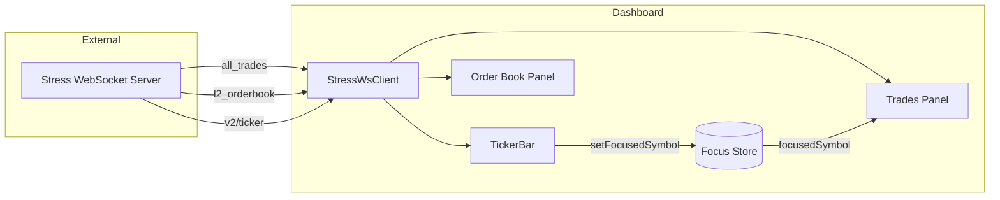
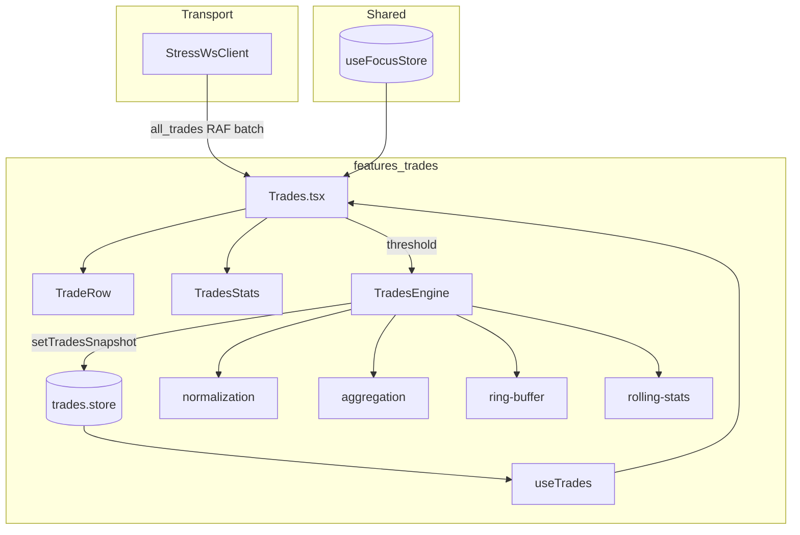
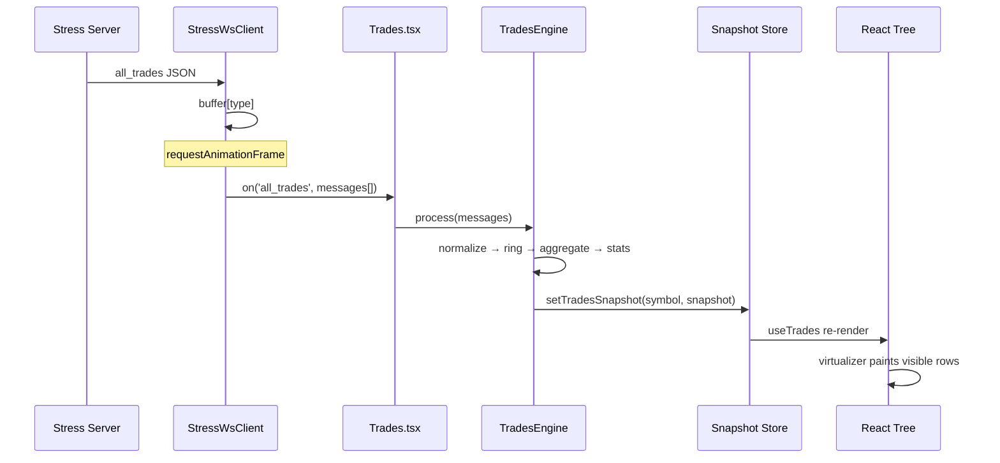
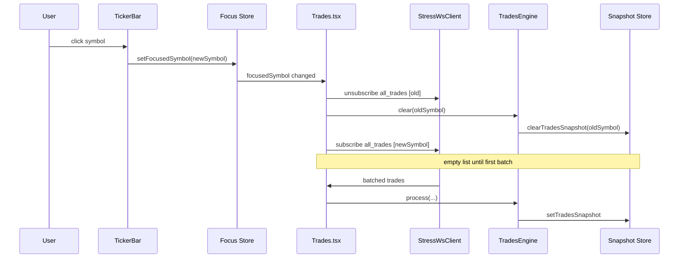
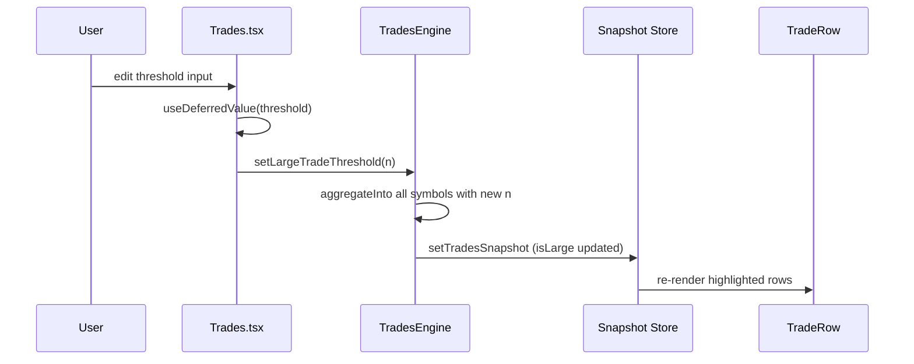
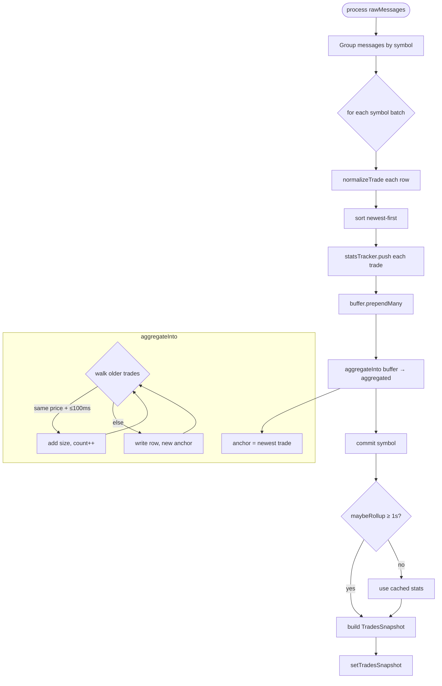
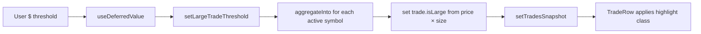

# Trades Panel — Architecture

Local architecture reference for the **Recent Trades** panel (`all_trades`). Derived from [`TRADES_REARCHITECTURE.md`](../../../TRADES_REARCHITECTURE.md) and [`REALTIME_DASHBOARD_PLAN.md`](../../../REALTIME_DASHBOARD_PLAN.md) §7.

---

## Table of Contents

1. [Goals](#goals)
2. [HLD — System Context](#hld--system-context)
3. [HLD — Dashboard Integration Flow](#hld--dashboard-integration-flow)
4. [Component Communication Diagrams](#component-communication-diagrams)
5. [HLD — Component View](#hld--component-view)
6. [HLD — End-to-End Data Flow](#hld--end-to-end-data-flow)
7. [HLD — Sequence Flows](#hld--sequence-flows)
8. [HLD — Engine Processing Flow](#hld--engine-processing-flow)
9. [HLD — Threshold Change Flow](#hld--threshold-change-flow)
10. [Runtime Flow](#runtime-flow)
11. [Directory Layout](#directory-layout)
12. [Layer Responsibilities](#layer-responsibilities)
13. [Data Model](#data-model)
14. [Aggregation Algorithm](#aggregation-algorithm)
15. [Rolling Stats](#rolling-stats)
16. [Large Trade Highlighting](#large-trade-highlighting)
17. [UI Composition](#ui-composition)
18. [Subscription Lifecycle](#subscription-lifecycle)
19. [Performance Model](#performance-model)
20. [Implementation Status](#implementation-status)
21. [Parity with Order Book](#parity-with-order-book)
22. [Related Documents](#related-documents)

---

## Goals

| Requirement | Target |
|-------------|--------|
| Update rate | 200+ trades/sec (stress server, 1–5 ms interval) |
| Main-thread work | Rendering + virtualization + scroll UX only |
| Buffer | 500 trades per symbol (newest-first ring buffer) |
| Aggregation | Same price within **100 ms** → merged row with `(count)` |
| Cross-batch merge | Bursts split across RAF frames must still merge |
| Stats | 60 s rolling window, UI refresh ~1 Hz |
| Large trades | User threshold on notional `price × size` (default $10,000) |
| Parity | Same engine → snapshot → hook pattern as order book |

---

## HLD — System Context

The trades panel shares the dashboard WebSocket and focus model with the order book. It subscribes to `all_trades` for the **focused symbol only**.



| Boundary | Responsibility |
|----------|----------------|
| Stress server | Trade prints with price, size, timestamp, buyer_role |
| `StressWsClient` | Transport, reconnect, RAF batching |
| Trades panel | Buffer, aggregate, stats, virtualized tape |
| Focus store | Active symbol for subscription |

---

## HLD — Dashboard Integration Flow

Single view of how the **trades panel** fits with the ticker, order book, shared WebSocket, and focus store (see [`App.tsx`](../../../App.tsx)). See [Component Communication Diagrams](#component-communication-diagrams) for rendered figures.

---

## Component Communication Diagrams

### Dashboard (all panels)


*Source file:* [`docs/architecture/dashboard-integration.svg`](../../../docs/architecture/dashboard-integration.svg)

### Trades panel (detail)


*Source file:* [`assets/component-communication.svg`](./assets/component-communication.svg)

Layers: **Transport** → **Panel** (`Trades.tsx`) → **Engine** → **Zustand snapshot** → **Virtualized tape + stats**.

```mermaid
flowchart TB
  subgraph User
    U[Trader]
  end

  subgraph UI["Dashboard UI"]
    CSB[ConnectionStatusBar]
    TB[TickerBar]
    OB["Order Book Panel<br/>l2_orderbook"]
    TR["Trades Panel<br/>all_trades"]
  end

  subgraph State
    FS[(useFocusStore<br/>focusedSymbol<br/>groupIncrements)]
    CS[(connection.store)]
  end

  subgraph Transport
    WS[StressWsClient<br/>RAF batch per channel]
  end

  subgraph Engines
    OBE[OrderBookEngine]
    TRE[TradesEngine]
  end

  subgraph Stores
    OBS[(orderbook snapshots)]
    TRS[(trades snapshots)]
    TKS[(ticker store)]
  end

  SS[(Stress WS Server)]

  U -->|click symbol| TB
  TB -->|setFocusedSymbol| FS
  U -->|edit large-trade $ | TR
  TR -->|setLargeTradeThreshold| TRE

  SS <-->|WebSocket| WS
  WS -->|onStatus| CS
  CS --> CSB

  WS -->|v2/ticker all 6 symbols| TB
  TB --> TKS

  FS -->|focusedSymbol| OB
  FS -->|focusedSymbol| TR

  WS -->|l2_orderbook RAF| OB
  OB --> OBE
  OBE --> OBS
  OBS --> OB

  WS -->|all_trades RAF| TR
  TR --> TRE
  TRE --> TRS
  TRS --> TR

  style TR fill:#2e1a1a
  style TRE fill:#2e1a1a
```

<details>
<summary>Mermaid source (dashboard integration)</summary>



</details>

**Subscription rules:**

| Channel | Symbols subscribed | Updated by |
|---------|-------------------|------------|
| `v2/ticker` | All 6 (`BTCUSD` … `DOGEUSD`) | `TickerBar` on mount |
| `l2_orderbook` | **Focused symbol only** | `OrderBook.tsx` effect |
| `all_trades` | **Focused symbol only** | `Trades.tsx` effect |

**On symbol change:** both panels unsubscribe the old symbol, clear engine state + snapshot, then subscribe the new symbol in parallel.

---

## HLD — Component View



---

## HLD — End-to-End Data Flow

```mermaid
flowchart TD
  A[WS: all_trades message] --> B[StressWsClient buffers by type]
  B --> C{RAF flush}
  C --> D[Trades handler: raw messages[]]
  D --> E[TradesEngine.process]
  E --> F[normalizeTrade per row]
  F --> G[RingBuffer.prependMany]
  G --> H[aggregateInto full buffer]
  H --> I[RollingStatsTracker.push]
  I --> J{maybeRollup 1 Hz}
  J --> K[TradesSnapshot]
  K --> L[Zustand setTradesSnapshot]
  L --> M[useTrades selector]
  M --> N[Virtualized TradeRow list]
  M --> O[TradesStats bar]
```

**Data shape transitions:**

```txt
Wire           Engine buffer        Aggregated display      Store
────           ─────────────        ──────────────────      ─────
RawTrade   →   Trade[] newest-first → Trade[] merged      → TradesSnapshot
               (max 500)              (100 ms window)          { trades, stats }
```

---

## HLD — Sequence Flows

### Tick ingest (steady state)



### Symbol focus change



### Large-trade threshold change



---

## HLD — Engine Processing Flow



**Cross-batch rule:** aggregation always runs on the **full ring buffer** after prepend, so trades in consecutive RAF batches at the same price still merge.

---

## HLD — Threshold Change Flow



---

## Runtime Flow

```txt
WebSocket (all_trades)
   ↓
StressWsClient.route()
   · RAF batch per message type
   ↓
Trades.tsx — subscribe focused symbol
   · engine.process(messages)
   ↓
TradesEngine (singleton)
   · normalize wire → Trade
   · prepend to RingBuffer (cap 500)
   · aggregateInto(buffer) — full buffer, 100 ms window
   · RollingStatsTracker.push per trade
   · maybeRollup stats (1 Hz)
   · setTradesSnapshot
   ↓
useTrades(symbol)  →  React
   ↓
@tanstack/react-virtual  →  memo(TradeRow)
TradesStats ← snapshot.stats
```

---

## Directory Layout

```txt
src/features/trades/
  ARCHITECTURE.md          ← this file
  index.ts
  types.ts               # re-exports / UI types
  components/
    Trades.tsx             # WS subscribe, virtualizer, threshold input
    TradeRow.tsx           # time, price, size, side, (count), large highlight
    TradesStats.tsx        # 60 s rolling summary bar
  engine/
    TradesEngine.ts        # orchestrator
    types.ts               # RawTrade, Trade, TradesSnapshot, RollingStats
    normalization.ts       # wire → Trade (side, id, numbers)
    aggregation.ts         # aggregateInto — 100 ms same-price merge
    ring-buffer.ts         # fixed-capacity newest-first buffer
    rolling-stats.ts       # deque + 1 Hz rollup
  store/
    trades.store.ts        # TradesSnapshot per symbol
    trades.actions.ts      # setTradesSnapshot, clearTradesSnapshot
  hooks/
    useTrades.ts           # Zustand selector
  data/
    dummy.ts               # static fixtures
```

**Legacy (deprecate):**

- `src/lib/trades/aggregate.ts` — ported to `engine/aggregation.ts`
- `src/lib/trades/aggregate.worker.ts` — replaced by engine main-thread path
- `src/lib/stress-ws/batcher.ts` — worker bridge for trades
- `src/lib/stores/trades/*` — old store if still referenced

---

## Layer Responsibilities

### WebSocket (`src/lib/stress-ws/client.ts`)

**Owns:** transport only (see order book architecture).

**Must not:** parse `buyer_role`, aggregate, or maintain ring buffers.

### Trades Engine (`engine/TradesEngine.ts`)

**Owns:**

| Concern | Module |
|---------|--------|
| Wire parsing | `normalization.ts` |
| Buffering | `ring-buffer.ts` |
| 100 ms aggregation | `aggregation.ts` |
| 60 s stats | `rolling-stats.ts` |
| Large-trade flags | `aggregation.ts` (notional check) |
| Snapshot emit | `commit()` → `setTradesSnapshot` |

**API:**

| Method | Purpose |
|--------|---------|
| `getInstance()` | Singleton |
| `process(rawMessages)` | Batch from RAF handler |
| `setLargeTradeThreshold(n)` | Re-flag all symbols + re-snapshot |
| `clear(symbol)` | Reset state + store |

**Per-symbol state:**

```ts
interface SymbolState {
  buffer: RingBuffer;           // max 500, newest-first
  aggregated: Trade[];          // display list (mutated in place)
  statsTracker: RollingStatsTracker;
}
```

### Zustand (`store/`)

```ts
type TradesSnapshotState = {
  snapshots: Partial<Record<TradingSymbol, TradesSnapshot | null>>;
};

type TradesSnapshot = {
  symbol: TradingSymbol;
  trades: Trade[];
  stats: RollingStats | null;
  largeTradeThreshold: number;
};
```

At most **one** `setTradesSnapshot` per symbol per engine commit.

### React (`components/`)

**Owns:**

- Virtualized trade list (`estimateSize: 28`, `h-7` rows)
- Threshold input with `useDeferredValue` → `engine.setLargeTradeThreshold`
- Footer “Jump to latest” → `scrollToIndex(0)`
- Empty / loading placeholders

**Must not:**

- Run `aggregateTrades` in render
- Scan 500 rows on `setInterval` for stats (engine owns rollup)

---

## Data Model

### Wire (WebSocket)

```ts
type RawTrade = {
  symbol: string;
  price: string | number;
  size: string | number;
  timestamp: number;        // microseconds
  buyer_role?: string;      // 'taker' → buy, else sell (see normalization)
};
```

Channel: `all_trades`. Subscribe only **focused** symbol (dashboard plan §3.3).

### Domain (`engine/types.ts`)

```ts
type Trade = {
  id: string;               // composite: timestamp_price_size
  timestamp: number;        // µs
  price: number;
  size: number;
  side: 'buy' | 'sell';
  aggregatedCount?: number; // present when count > 1
  isLarge?: boolean;        // price * size >= threshold
};

type RollingStats = {
  buyVolume: number;
  sellVolume: number;
  tradeCount: number;
  avgSize: number;
};
```

---

## Aggregation Algorithm

Implemented in `engine/aggregation.ts` as `aggregateInto`.

### Rules

```txt
Input:  newest-first Trade[] (ring buffer.items)
Window: 100_000 µs (100 ms)
Match:  same price as anchor (consecutive in sorted-newest walk)
        AND anchor.timestamp - trade.timestamp <= WINDOW_US

Output: newest-first aggregated rows
        aggregatedCount set when groupCount > 1
```

### Cross-batch correctness

`TradesEngine.processBatch`:

1. Normalize and sort batch newest-first
2. `buffer.prependMany(normalized)`
3. `aggregateInto(buffer.items, aggregated, threshold)` on the **full buffer**

### Stable references

`aggregateInto` reuses existing `out[i]` object when `id`, `size`, `aggregatedCount`, and `isLarge` are unchanged — helps `React.memo(TradeRow)`.

---

## Rolling Stats

`engine/rolling-stats.ts` — plan §7.7.

```txt
on each trade:
  push { timestamp, size, side, notional } to deque
  prune entries older than 60 s (µs-aware)

on commit (maybeRollup):
  if ≥ 1 s since last rollup:
    compute buyVolume, sellVolume, tradeCount, avgSize
    cache in snapshot.stats
```

`TradesStats` reads `snapshot.stats` only — no React `setInterval` scan.

---

## Large Trade Highlighting

- Default threshold: **$10,000** notional (`price × size`)
- User edits threshold in header → `useDeferredValue` → `engine.setLargeTradeThreshold`
- Engine re-runs `aggregateInto` for all active symbols and sets `trade.isLarge`
- `TradeRow` styles large trades from `trade.isLarge` (not inline math in render)

---

## UI Composition

```txt
Trades
├── header: title, large-trade threshold input
├── TradesStats: buy vol / sell vol / count / avg size (60 s)
├── column headers: Time | Price (USD) | Size
├── virtualized list (newest at top)
└── footer: Jump to latest
```

### Virtualization

- `getItemKey: (i) => trades[i].id`
- `overscan: 5`
- Scroll parent `h-96 overflow-y-auto`

### Scroll UX

- **Jump to latest** footer scrolls virtualizer to index `0` (newest row)

---

## Subscription Lifecycle

```txt
focus symbol change
   → unsubscribe all_trades [old]
   → engine.clear(old)
   → subscribe all_trades [new]
   → empty snapshot until first batch

unmount / leave panel
   → unsubscribe + clear (via effect cleanup)
```

---

## Performance Model

| Stage | Complexity | Notes |
|-------|------------|-------|
| Normalize batch | O(batch) | |
| Ring prepend | O(batch) | No `[...incoming, ...prev]` spread |
| Full aggregate | O(buffer) ≤ 500 | Per RAF flush |
| Stats push/prune | O(1) amortized | Deque prune |
| Zustand commit | O(1) | |
| React virtual | O(visible) | |

**Stress target:** stable UI at 200+ trades/sec with ≤ 1 store commit per frame per symbol.

---

## Implementation Status

| Item | Status |
|------|--------|
| TradesEngine + snapshot store | Done |
| RingBuffer (500 cap) | Done |
| Full-buffer `aggregateInto` | Done |
| Cross-batch 100 ms merge | Done |
| RollingStatsTracker in engine | Done |
| `isLarge` on Trade objects | Done |
| `useTrades` hook | Done |
| Virtualized list + TradeRow memo | Done |
| Deferred threshold → engine | Done |

---

## Parity with Order Book

| Concern | Order book | Trades |
|---------|------------|--------|
| Engine location | `features/orderbook/engine/` | `features/trades/engine/` |
| Store shape | `ProcessedBook` snapshots | `TradesSnapshot` snapshots |
| Hook | `useOrderBook(symbol)` | `useTrades(symbol)` |
| WS subscribe | `OrderBook.tsx` | `Trades.tsx` |
| RAF batching | `StressWsClient` | `StressWsClient` |
| Focus symbol | `useFocusStore` | `useFocusStore` |

---

## Related Documents

| Document | Scope |
|----------|--------|
| [`TRADES_REARCHITECTURE.md`](../../../TRADES_REARCHITECTURE.md) | Full migration plan |
| [`ORDERBOOK_REARCHITECTURE.md`](../../../ORDERBOOK_REARCHITECTURE.md) | Parallel engine pattern |
| [`REALTIME_DASHBOARD_PLAN.md`](../../../REALTIME_DASHBOARD_PLAN.md) | Product requirements §7 |
| [`src/features/orderbook/ARCHITECTURE.md`](../orderbook/ARCHITECTURE.md) | Order book panel HLD |

---

*Last updated: reflects `features/trades/engine/` implementation and dashboard plan §7.*
